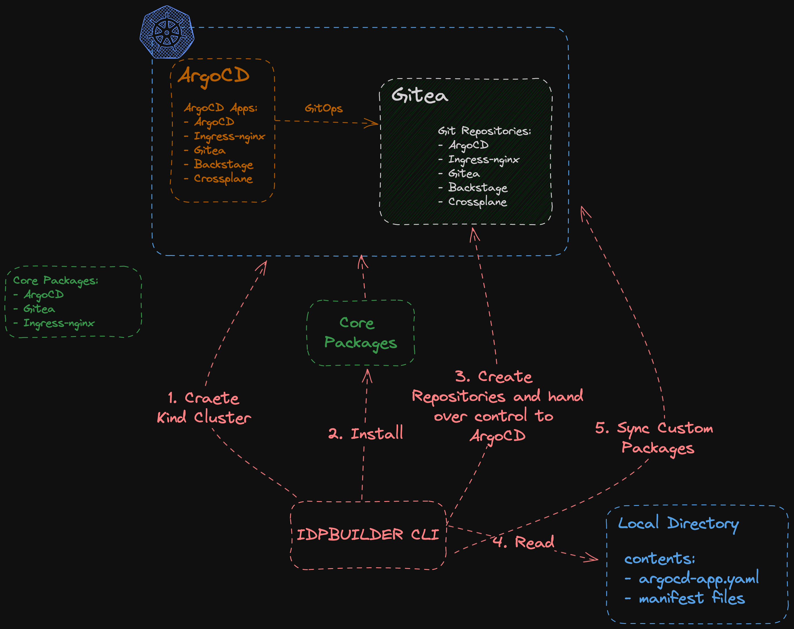

# Contributing guide

Welcome to the project, and thanks for considering contributing to this project. 
This document should answer many questions you may have about contributing to this project.

If you have any questions or need clarifications on topics covered here, please feel free to reach out to us on the [#cnoe-interest](https://cloud-native.slack.com/archives/C05TN9WFN5S) channel on CNCF Slack.

## Setting up a development environment

To get started with the project on your machine, you need to install the following tools:
1. Go 1.21+. See [this official guide](https://go.dev/doc/install) from Go authors.
2. Make. You can install it through a package manager on your system. E.g. Install `build-essential` for Ubuntu systems.
3. Docker. Similar to Make, you can install it through your package manager.

Once required tools are installed, clone this repository. `git clone https://github.com/cnoe-io/idpbuilder.git`.

Then change your current working directory to the repository root. e.g. `cd idpbuilder`.

All subsequent commands described in this document assumes they are executed from the repository root.

## Building from the main branch

1. Checkout the main branch. `git checkout main`
2. Build the binary. `make build`. This compiles the project. It will take several minutes for the first time. Example output shown below:
    ```
    ~/idpbuilder$ make build
    test -s /home/ubuntu/idpbuilder/bin/controller-gen && /home/ubuntu/idpbuilder/bin/controller-gen --version | grep -q v0.12.0 || \
    GOBIN=/home/ubuntu/idpbuilder/bin go install sigs.k8s.io/controller-tools/cmd/controller-gen@v0.12.0
    /home/ubuntu/idpbuilder/bin/controller-gen rbac:roleName=manager-role crd webhook paths="./api/..." output:crd:artifacts:config=pkg/controllers/resources
    /home/ubuntu/idpbuilder/bin/controller-gen object:headerFile="hack/boilerplate.go.txt" paths="./..."
    go fmt ./...
    go vet ./...
    go build -o idpbuilder main.go  
    ```
3. Once build finishes, you should have an executable file called `idbuilder` in the root of the repository.
4. The file should be ready to use. Execute the file to confirm. `./idpbuilder --help`


### Testing basic functionalities

To test the very basic functionality of idpbuilder, Run the following command: `./idbuilder create`

This command creates the following resources on your machine. 

1. [Kind](https://kind.sigs.k8s.io/) cluster.
2. [ArgoCD](https://argo-cd.readthedocs.io/en/stable/) resources.
3. [Gitea](https://about.gitea.com/) resources.
4. [Crossplane](https://www.crossplane.io/) deployment. No providers.
5. [Backstage](https://backstage.io/) resources.

They are deployed as ArgoCD Applications with the Gitea repositories set as their sources. 

UIs for Backstage, Gitea, and ArgoCD are accessible on the machine:
* Gitea: http://gitea.cnoe.localtest.me:8443/explore/repos
* Backstage: http://backstage.cnoe.localtest.me:8880/
* ArgoCD: https://argocd.cnoe.localtest.me:8443/applications

ArgoCD username is `admin` and the password can be obtained with 
```
kubectl -n argocd get secret argocd-initial-admin-secret -o go-template='{{ range $key, $value := .data }}{{ printf "%s: %s\n" $key ($value | base64decode) }}{{ end }}'
```

Gitea admin credentials can be obtained with 
```
kubectl get secrets -n gitea gitea-admin-secret -o go-template='{{ range $key, $value := .data }}{{ printf "%s: %s\n" $key ($value | base64decode) }}{{ end }}'
```

All ArgoCD applications should be synced and healthy. You can check them in the UI or 
```
kubectl get application -n argocd
```

## idpbuilder Overview

idpbuilder is made of two phases: CLI and controllers.

### CLI

During this phase: 
1. This is the phase where command flags are parsed and translated into relevant Go structs' fields. Most notably the [`LocalBuild`](https://github.com/cnoe-io/idpbuilder/blob/main/api/v1alpha1/localbuild_types.go) struct.
2. Create a Kind cluster, then update the kubeconfig file.
3. Once the kind cluster is started and relevant fields are populated, Kubernetes controllers are started:
    *  `LocalbuildReconciler` responsible for bootstrapping the cluster with absolute necessary packages. Creates Custom Resources (CRs) and installs embedded manifests.
    *  `RepositoryReconciler` responsible for creating and managing Gitea repository and repository contents.
    *  `CustomPackageReconciler` responsible for managing custom packages.  
4. They are all managed by a single Kubernetes controller manager.
5. Once controllers are started, CRs corresponding to these controllers are created. For example for Backstage, it creates a GitRepository CR and ArgoCD Application.
6. CLI then waits for these CRs to be ready.

### Controllers

During this phase, controllers act on CRs created by the CLI phase.

#### LocalbuildReconciler

`LocalbuildReconciler` bootstraps the cluster using embedded manifests. Embedded manifests are yaml files that are baked into the binary at compile time.
1. Install Bootstrap apps. They are essential services that are needed for the user experiences we want to enable:
    * Gitea. This is the in-cluster Git server that hosts Git repositories.
    * Ingress-nginx. This is necessary to expose services inside the cluster to the users.
    * ArgoCD. This is used as the packaging mechanism. Its primary purpose is to deploy manifests from gitea repositories. 
2. Once they are installed, create `GitRepository` CRs for bootstrap apps.
3. Create ArgoCD applications for the apps. Point them to the Gitea repositories. From here on, ArgoCD manages the bootstrap apps.

Once bootstrap apps are installed, it creates the other embedded applications: Backstage and Crossplane.
1. Create `GitRepository` CRs for the apps.
2. Create ArgoCD applications for the apps.


#### RepositoryReconciler

`RepositoryReconciler` creates Gitea repositories.
The content of the repositories can either be sourced from Embedded file system or local file system.

#### CustomPackageReconciler

`CustomPackageReconciler` parses the specified ArgoCD application files. If they specify repository URL with the scheme `cnoe://`,
it creates `GitRepository` CR with source specified as local, then creates ArgoCD application with the repository URL replaced.

For example, if an ArgoCD application is specified as the following.

```yaml
apiVersion: argoproj.io/v1alpha1
kind: Application
spec:
  source:
    repoURL: cnoe://busybox
```

Then, the actual object created is this.

```yaml
apiVersion: argoproj.io/v1alpha1
kind: Application
spec:
  source:
    repoURL: http://my-gitea-http.gitea.svc.cluster.local:3000/giteaAdmin/idpbuilder-localdev-my-app-busybox.git
```


