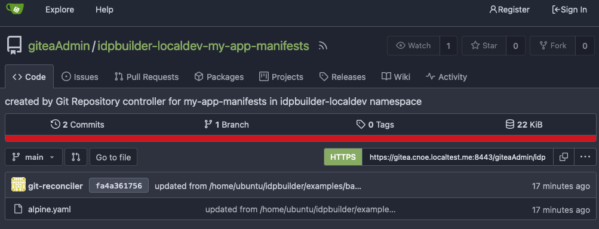
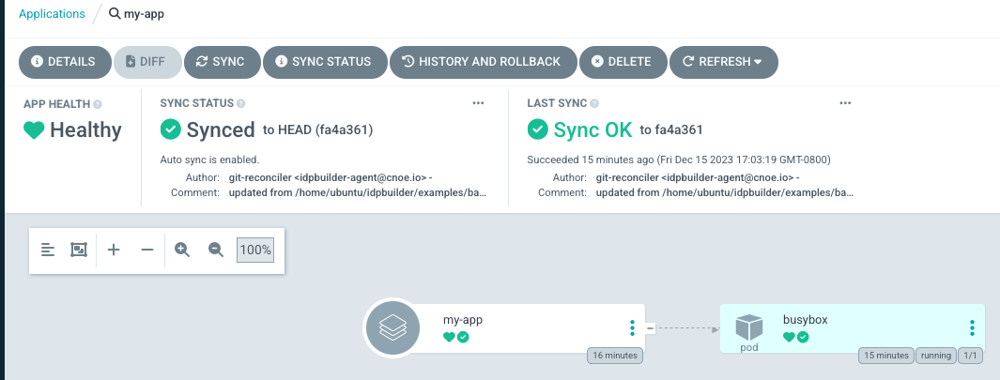

[![Codespell][codespell-badge]][codespell-link]
[![E2E][e2e-badge]][e2e-link]
[![Go Report Card][report-badge]][report-link]
[![Commit Activity][commit-activity-badge]][commit-activity-link]

# IDP Builder

Internal development platform binary launcher.

> **WORK IN PROGRESS**: This tool is in a pre-release stage and is under active development.

## About

Spin up a complete internal developer platform using industry standard technologies like Kubernetes, Argo, and backstage with only Docker required as a dependency.

This can be useful in several ways:
* Create a single binary which can demonstrate an IDP reference implementation.
* Use within CI to perform integration testing.
* Use as a local development environment for IDP engineers.

## Prerequisites

A container engine is needed locally such as:

| Name                                                  | Supported | Remark                                                                                                                              |
|-------------------------------------------------------|-----------|-------------------------------------------------------------------------------------------------------------------------------------|
| [Docker desktop](https://www.docker.com/get-started/) | Yes       |                                                                                                                                     |
| [Podman desktop](https://podman-desktop.io/)          | No        | idpbuilder can create a cluster using podman [rootful](https://docs.podman.io/en/latest/markdown/podman-machine-set.1.html#rootful) | 


**Note**: Set the `DOCKER_HOST` env var property using `podman` to let idpbuilder to talk with the engine (e.g  export DOCKER_HOST="unix:///var/run/docker.sock")

## Getting Started

If you are interested in running idpbuilder in Codespaces through your browser, check out the [Codespaces](#running-in-codespaces) section.

### Quick Install

The following command can be used as a convenience for installing `idpbuilder`, (be sure to check the script first if you are concerned):
```
curl -fsSL https://raw.githubusercontent.com/cnoe-io/idpbuilder/main/hack/install.sh | bash
```

or download the latest stable release with the following commands:

```bash
version=$(curl -s https://api.github.com/repos/cnoe-io/idpbuilder/releases | grep tag_name | grep -o -e '"v[0-9].[0-9].[0-9]"' | head -n1 | sed 's/"//g')
curl -L --progress-bar -o ./idpbuilder.tar.gz "https://github.com/cnoe-io/idpbuilder/releases/download/${version}/idpbuilder-$(uname | awk '{print tolower($0)}')-$(uname -m | sed 's/x86_64/amd64/').tar.gz"
tar xzf idpbuilder.tar.gz

./idpbuilder version
# example output
# idpbuilder 0.4.1 go1.21.5 linux/amd64
```

Alternatively, you can download the latest binary from [the latest release page](https://github.com/cnoe-io/idpbuilder/releases/latest).

## Using the idpbuilder

### Basic usage

The most basic command which creates a Kubernetes Cluster (Kind cluster) with the core packages installed.

```bash
./idpbuilder create
```

<details>
  <summary>What are the core packages?</summary>

  * **ArgoCD** is the GitOps solution to deploy manifests to Kubernetes clusters. In this project, a package is an ArgoCD application. 
  * **Gitea** server is the in-cluster Git server that ArgoCD can be configured to sync resources from. You can sync from local file systems to this.
  * **Ingress-nginx** is used as a method to access in-cluster resources such as ArgoCD UI and Gitea UI.

    #### Core package versions
    
    | Name     | Version |
    | -------- | ------- |
    | Argo CD  | v2.10.7 |
    | Gitea    | v9.5.1  |
    | Nginx    | v1.8.1  |

  The default manifests for the core packages are available [here](pkg/controllers/localbuild/resources).
  See the [contribution doc](./CONTRIBUTING.md) for more information on how core packages are installed and configured.

</details>


Once idpbuilder finishes provisioning cluster and packages, you can access GUIs by going to the following addresses in your browser.

* ArgoCD: https://argocd.cnoe.localtest.me:8443/
* Gitea: https://gitea.cnoe.localtest.me:8443/

#### Secrets
You can obtain credentials for them by running the following command:

```bash
./idpbuilder get secrets
```

<details>
  <summary> The "get secrets" command </summary>

  The `get secrets` command retrieves the following:
  - ArgoCD initial admin password.
  - Gitea admin user credentials.
  -  Any secrets labeled with `cnoe.io/cli-secret=true`.

  You can think of the command as executing the following kubectl commands:

  ```bash
  kubectl -n argocd get secret argocd-initial-admin-secret
  kubectl get secrets -n gitea gitea-admin-secret
  kubectl get secrets -A -l cnoe.io/cli-secret=true
  ```
  In addition, secrets labeled with `cnoe.io/package-name` can be specified with the `-p` flag. For example, for Gitea:

  ```bash
  ./idpbuilder get secrets -p gitea
  ```

</details>

###  Example commands

**For more advanced use cases, check out the [Stacks Repository](https://github.com/cnoe-io/stacks).**

You can specify the kubernetes version by using the `--kube-version` flag. Supported versions are available [here](https://github.com/kubernetes-sigs/kind/releases).

```
./idpbuilder create --kube-version v1.27.3
```

If you want to specify your own kind configuration file, use the `--kind-config` flag.

```
./idpbuilder create --build-name local --kind-config ./my-kind.yaml`
```

If you want to specify ArgoCD configmap.

```
./idpbuilder create --package-custom-file=argocd:pkg/k8s/test-resources/input/argocd-cm.yaml
```

Run the following commands for available flags and subcommands:

```
./idpbuilder --help
./idpbuilder create --help
```

### Custom Packages

Idpbuilder supports specifying custom packages using the flag `--package` flag. 
This flag expects a directory (local or remote) containing ArgoCD application files and / or ArgoCD application set files.
In case of a remote directory, it must be a directory in a git repository, 
and the URL format must be a [kustomize remote URL format](https://github.com/kubernetes-sigs/kustomize/blob/master/examples/remoteBuild.md).

Examples of using custom packages are available in the [stacks repository](https://github.com/cnoe-io/stacks).
Let's take a look at [this example](https://github.com/cnoe-io/stacks/tree/main/basic). This defines two custom package directories to deploy to the cluster.

To deploy these packages, run the following command.

```
idpbuilder create --package https://github.com/cnoe-io/stacks//basic/package1 --package https://github.com/cnoe-io/stacks//basic/package2

```

Alternatively, you can use the local directory format.

```bash
# clone the stacks repository
git clone https://github.com/cnoe-io/stacks.git
cd stacks
# run idpbuilder against the local directory
idpbuilder create --package basic/package1  --package basic/package2

```

Running this command should create three additional ArgoCD applications in your cluster.

```sh
$ kubectl get Applications -n argocd  -l example=basic
NAME         SYNC STATUS   HEALTH STATUS
guestbook    Synced        Healthy
guestbook2   Synced        Healthy
my-app       Synced        Healthy
```

Let's break this down. The [first package directory](https://github.com/cnoe-io/stacks/tree/main/basic/package1) defines an application. 
This corresponds to the `my-app` application above. In this application, we want to deploy manifests from local machine in GitOps way.

The directory contains an [ArgoCD application file](https://github.com/cnoe-io/stacks/blob/main/basic/package1/app.yaml). 
This is a normal ArgoCD application file except for one field.

```yaml
apiVersion: argoproj.io/v1alpha1
kind: Application
spec:
  source:
    repoURL: cnoe://manifests
```

The `cnoe://` prefix in the `repoURL` field indicates that we want to sync from a local directory.
Values after `cnoe://` is treated as a relative path from this file. In this example, 
we are instructing idpbuilder to make ArgoCD sync from files in the [manifests directory](https://github.com/cnoe-io/stacks/tree/main/basic/package1/manifests).

As a result the following actions were taken by idpbuilder: 
1. Create a Gitea repository.
2. Fill the repository with contents from the manifests directory.
3. Update the Application spec to use the newly created repository.

You can verify this by going to this address in your browser: https://gitea.cnoe.localtest.me:8443/giteaAdmin/idpbuilder-localdev-my-app-manifests




This is the repository that corresponds to the [manifests](https://github.com/cnoe-io/stacks/tree/main/basic/package1/manifests) folder.
It contains a file called `alpine.yaml`, synced from the `manifests` directory above.

You can also view the updated Application spec by going to this address: https://argocd.cnoe.localtest.me:8443/applications/argocd/my-app




The second package directory defines two normal ArgoCD applications referencing a remote repository.
They are applied as-is.

## Local OCI Registry

The local Gitea instance created by idpbuilder contains a built in OCI registry for hosting container images as "packages" in Gitea nomenclature.

It is a standard OCI registry, so the API should be compatible with any tools that are OCI compliant. That includes the `docker` cli.

For example you can push an image by running:

```bash
docker login gitea.cnoe.localtest.me:8443                                          
Username: giteaAdmin
Password: 
docker push gitea.cnoe.localtest.me:8443/giteaadmin/beacon.idpbuilder:with-app-fix2
The push refers to repository [gitea.cnoe.localtest.me:8443/giteaadmin/beacon.idpbuilder]
78a0cd9d2976: Layer already exists 
with-app-fix2: digest: sha256:50dc814b89e22988a69ac23aa7158daa834ab450b38b299e7f7fe17dba0ce992 size: 5566
```

*NOTE: You can get the giteaAdmin password in the same way as you do for the web or git interface.*

```bash
  ./idpbuilder get secrets -p gitea
```

Or you can use this one liner to login:

```bash
idpbuilder get secrets -p gitea -o json | jq '.[0].data.password' -r | docker login -u giteaAdmin --password-stdin gitea.cnoe.localtest.me:8443
```

### Pulling Images

You can pull an image back to your local machine using your docker client like so:

```
docker push gitea.cnoe.localtest.me:8443/giteaadmin/beacon.idpbuilder
Using default tag: latest
latest: Pulling from giteaadmin/beacon.idpbuilder
Digest: sha256:6308ebbce176470277dcca5e59aee3d528d9798a19f13d6a73ddd74a3f5da17b
Status: Downloaded newer image for gitea.cnoe.localtest.me:8443/giteaadmin/beacon.idpbuilder:latest
gitea.cnoe.localtest.me:8443/giteaadmin/beacon.idpbuilder:latest
```

### Referencing Images In Manifests On The Idpbuilder K8s Cluster
If you are creating a pod or a deployment of some sort, you can reference the images on the cluster using the same image name and tag like in the following example:

```
apiVersion: apps/v1
kind: Deployment
metadata:
  annotations:
spec:
  template:
    spec:
      containers:
      - image: gitea.cnoe.localtest.me:8443/giteaadmin/beacon.idpbuilder:with-app-fix2
        imagePullPolicy: IfNotPresent
```

### No Pull Secret Needed
Our gitea instance allows for anonymous read access. This means that you can pull git repo contents and container images without the need to login.

### Only Works With Subdomain Based Idpbuilder Installations
Right now because of the way the OCI registry specifications discovers information about a repo, this will only work with subdomain `gitea.cnoe.localtest.me`
based installations of idpbuilder's core capabilities.

If you would like to use path based routing, you will have to install and manage your own OCI registry at this time.
Other registries might be able to handle this better, however which registries and how to configure them is beyond the scope of this readme.

For more info on the OCI registry spec and the root cause of this "discovery" issue see the spec here:
https://specs.opencontainers.org/distribution-spec/?v=v1.0.0#checking-if-content-exists-in-the-registry

### Pulling Images From Inside Idpbuilder K8s Cluster:

Because we are using an NGINX Ingress and pushing our image from off cluster,
Gitea and it's OCI registry think all images pushed to it are prefixed with `gitea.cnoe.localtest.me:8443`.

This is correct by the OCI spec standards. However when you are on the cluster, that ingress is not available to you. 
You can use the service name of gitea, but gitea will not know what images are being asked for at the svc domain name.

So we use containerd to rewrite those image names so that they can be referenced at the external url:

See `./pkg/kind/resources/kind.yaml.tmpl` for how this is done.

## Contributing

If you'd like to contribute to the project or know the architecture and internals of this project, check out the [contribution doc](./CONTRIBUTING.md).

## Running in Codespaces

1. Create a Codespaces instance. 
2. Wait for it to be ready. It may take several minutes.
3. Get the latest release of idpbuilder:
   ```bash
    version=$(curl -Ls -o /dev/null -w %{url_effective} https://github.com/cnoe-io/idpbuilder/releases/latest)
    version=${version##*/}
    curl -L -o ./idpbuilder.tar.gz "https://github.com/cnoe-io/idpbuilder/releases/download/${version}/idpbuilder-$(uname | awk '{print tolower($0)}')-$(uname -m | sed 's/x86_64/amd64/').tar.gz"
    tar xzf idpbuilder.tar.gz
   ```
4. Run idpbuilder:
   ```
    idpbuilder create --protocol http  \
    --host ${CODESPACE_NAME}-8080.${GITHUB_CODESPACES_PORT_FORWARDING_DOMAIN} \
    --port 8080 --use-path-routing
   ```
5. Because Codespaces gives a single externally routable host name for an instance, idpbuilder must deploy with path based routing. 
   This means ArgoCD and Gitea UIs are given with the following commands.
   * ArgoCD: `echo https://${CODESPACE_NAME}-8080.${GITHUB_CODESPACES_PORT_FORWARDING_DOMAIN}/argocd`
   * Gitea: `echo https://${CODESPACE_NAME}-8080.${GITHUB_CODESPACES_PORT_FORWARDING_DOMAIN}/gitea`
6. Note that not all examples work with path based routing. 

## Extending the IDP builder

We are actively working to include more patterns and examples of extending idpbuilder to get started easily.

<!-- JUST BADGES & LINKS -->
[codespell-badge]: https://github.com/cnoe-io/idpbuilder/actions/workflows/codespell.yaml/badge.svg
[codespell-link]: https://github.com/cnoe-io/idpbuilder/actions/workflows/codespell.yaml

[e2e-badge]: https://github.com/cnoe-io/idpbuilder/actions/workflows/e2e.yaml/badge.svg
[e2e-link]: https://github.com/cnoe-io/idpbuilder/actions/workflows/e2e.yaml

[report-badge]: https://goreportcard.com/badge/github.com/cnoe-io/idpbuilder
[report-link]: https://goreportcard.com/report/github.com/cnoe-io/idpbuilder

[commit-activity-badge]: https://img.shields.io/github/commit-activity/m/cnoe-io/idpbuilder
[commit-activity-link]: https://github.com/cnoe-io/idpbuilder/pulse
