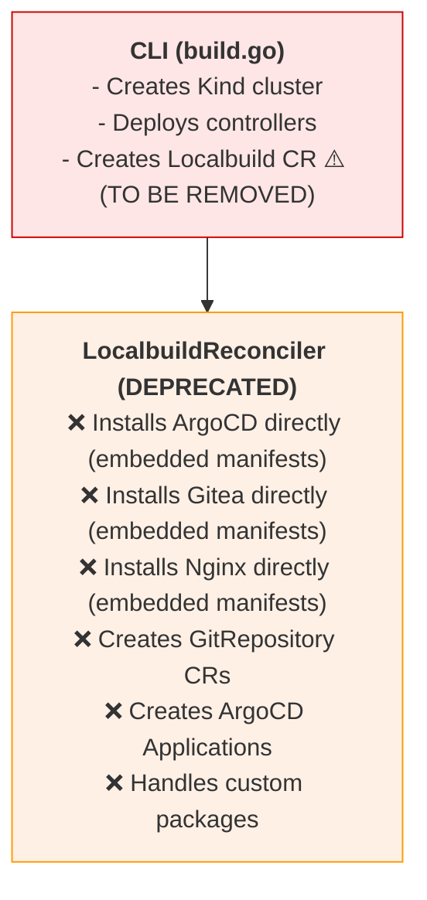
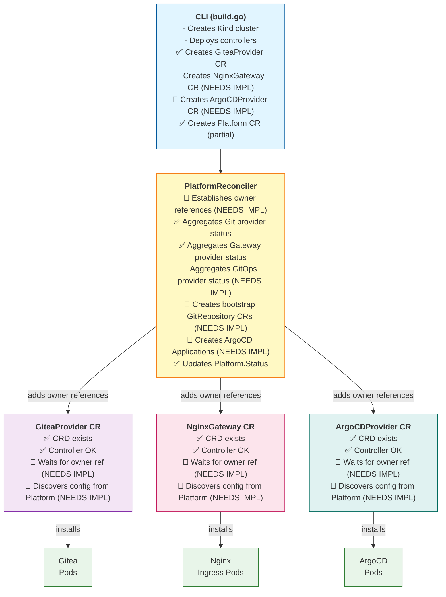
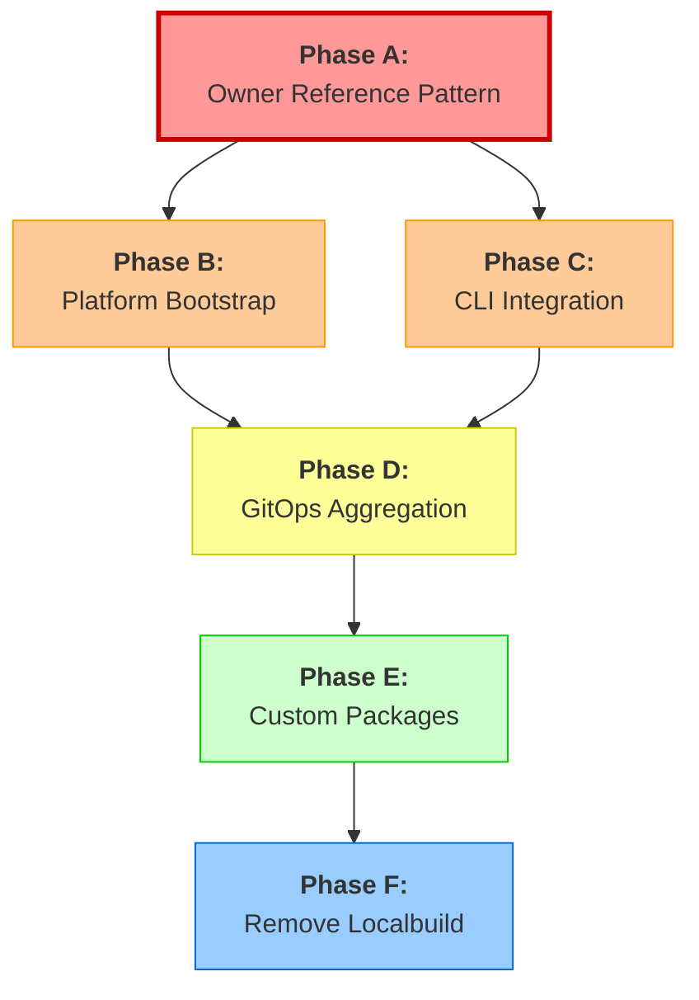
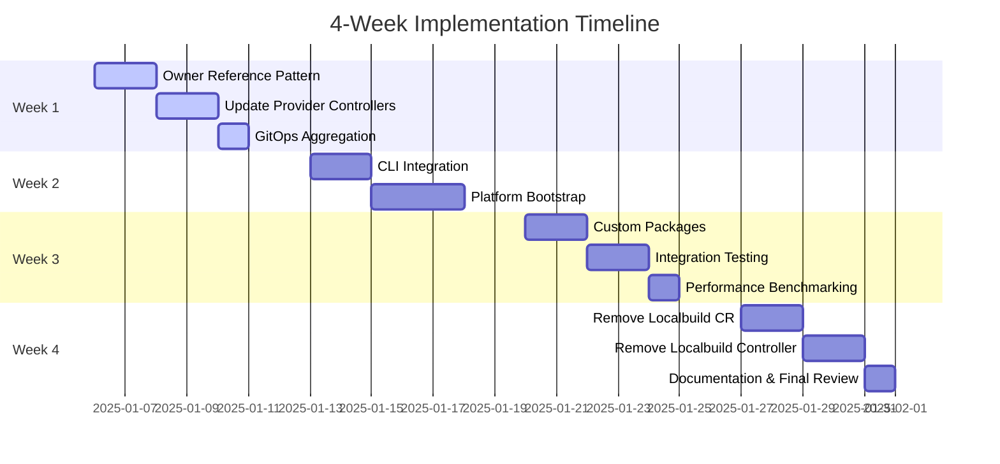

# Architecture Transition: v1alpha1 (Localbuild) → v1alpha2 (Platform-Based)

## Visual Overview

### Current State (v1alpha1 with Localbuild)



### Target State (v1alpha2 with Platform + Providers)



## Key Differences

### 1. **Localbuild Controller** (Old - To Be Removed)
- **Single monolithic controller** doing everything
- **Tight coupling** between components
- **Embedded installation logic** in Go code
- **Hard to customize** without recompiling
- **Sequential installation** (one after another)

### 2. **Platform + Provider Architecture** (New - Target)
- **Separation of concerns** (Platform orchestrates, Providers install)
- **Duck-typing** enables provider independence
- **Declarative CRs** for configuration
- **Easy to customize** via YAML
- **Parallel installation** where possible
- **Extensible** (can add new provider types)

## Migration Checklist

### Phase A: Owner Reference Pattern ⚠️ **CRITICAL PATH**

This is the foundation of the new architecture (spec lines 344-643).

```
Legend:
  ✅ = Complete
  🔲 = Not started
  🚧 = In progress
  ❌ = Blocked
```

**Platform Controller:**
- 🔲 Implement `ensureOwnerReference()` method
- 🔲 Add `ensureProviderOwnerReferences()` to Reconcile loop
- 🔲 Add RBAC for updating provider CRs
- 🔲 Add helper function `getPlatformOwnerReference()`

**GiteaProvider Controller:**
- 🔲 Add owner reference check at start of Reconcile()
- 🔲 Add "WaitingForPlatform" phase
- 🔲 Implement configuration discovery from Platform
- 🔲 Add requeue logic while waiting

**NginxGateway Controller:**
- 🔲 Add owner reference check at start of Reconcile()
- 🔲 Add "WaitingForPlatform" phase
- 🔲 Implement configuration discovery from Platform
- 🔲 Add requeue logic while waiting

**ArgoCDProvider Controller:**
- 🔲 Add owner reference check at start of Reconcile()
- 🔲 Add "WaitingForPlatform" phase
- 🔲 Implement configuration discovery from Platform
- 🔲 Add requeue logic while waiting

**Testing:**
- 🔲 Unit test: ensureOwnerReference()
- 🔲 Unit test: Provider wait-for-owner logic
- 🔲 Integration test: Platform → Provider lifecycle
- 🔲 E2E test: Full workflow with owner references

### Phase B: Platform Bootstrap Creation

**Platform Controller:**
- 🔲 Add `createBootstrapRepositories()` method
- 🔲 Move `reconcileGitRepo()` from Localbuild controller
- 🔲 Move `reconcileEmbeddedApp()` from Localbuild controller
- 🔲 Update to use duck-typed git provider access
- 🔲 Create ArgoCD Applications for bootstrap apps

**GitRepository Controller:**
- ✅ Already works with duck-typed providers (via localbuild)
- 🔲 Verify compatibility with Platform-created repos

**Testing:**
- 🔲 Unit test: Bootstrap repository creation
- 🔲 Integration test: GitRepository → Gitea sync
- 🔲 E2E test: Bootstrap apps in ArgoCD

### Phase C: CLI Integration

**build.go:**
- ✅ `createGiteaProvider()` - Already implemented
- 🔲 `createNginxGateway()` - Needs implementation
- 🔲 `createArgoCDProvider()` - Needs implementation
- ✅ `createPlatform()` - Exists but needs update
  - 🔲 Add Gateways reference
  - 🔲 Add GitOpsProviders reference

**Call sequence in Run():**
- Line 322: ✅ `createGiteaProvider()`
- Line 327: 🔲 `createNginxGateway()` - ADD THIS
- Line XXX: 🔲 `createArgoCDProvider()` - ADD THIS
- Line 330: ✅ `createPlatform()` - UPDATE THIS

**Testing:**
- 🔲 E2E test: `idpbuilder create` with v1alpha2
- 🔲 Verify all provider CRs created
- 🔲 Verify Platform references all providers

### Phase D: GitOps Provider Aggregation

**Platform Controller:**
- 🔲 Add `aggregateGitOpsProviders()` method
- 🔲 Call in Reconcile() after gateway aggregation
- 🔲 Update allReady logic to include gitops
- 🔲 Add RBAC for reading ArgoCDProvider

**Testing:**
- 🔲 Unit test: aggregateGitOpsProviders()
- 🔲 Verify Platform.Status includes GitOps providers
- 🔲 Verify Platform Ready condition

### Phase E: Custom Package Migration

**Decision Point:**
- 🔲 Option A: Move to Platform controller
- 🔲 Option B: Enhance existing CustomPackage controller

**Implementation (whichever chosen):**
- 🔲 Update to use duck-typed providers
- 🔲 Maintain priority handling
- 🔲 Support dirs, files, URLs

**Testing:**
- 🔲 Test with custom package directory
- 🔲 Test with custom package file
- 🔲 Test with custom package URL
- 🔲 Test package priority conflicts

### Phase F: Remove Localbuild

**build.go:**
- 🔲 Remove Localbuild CR creation (lines 281-318)
- 🔲 Update `isCompatible()` to use Platform CR
- 🔲 Remove references to `v1alpha1.Localbuild`

**controllers/run.go:**
- 🔲 Remove LocalbuildReconciler registration
- 🔲 Update controller setup comments

**Deletion:**
- 🔲 Delete `pkg/controllers/localbuild/` directory
- 🔲 Add deprecation notice to v1alpha1 CRD

**Documentation:**
- 🔲 Update user guide to use v1alpha2
- 🔲 Create migration guide from v1alpha1
- 🔲 Update API reference documentation

## Critical Path Analysis



**Critical dependencies:**
1. **Owner Reference Pattern** must be completed first
   - Everything else depends on this
   - Providers won't work correctly without it
   
2. **CLI Integration** can proceed in parallel with Platform Bootstrap
   - Both depend on Owner Reference Pattern
   - Can be developed/tested independently
   
3. **Custom Packages** should wait until others are stable
   - Less critical path
   - More complex migration decision

4. **Remove Localbuild** is the final step
   - Only after everything else is complete and tested
   - Requires thorough validation

## Estimated Timeline



## Success Metrics

**Before (v1alpha1):**
- Time to cluster ready: ~2-3 minutes
- Components: 1 CR (Localbuild)
- Controllers: 1 (LocalbuildReconciler)
- Flexibility: Low (embedded logic)
- Customization: Requires recompilation

**After (v1alpha2):**
- Time to cluster ready: ~2-3 minutes (same or better)
- Components: 4 CRs (Platform + 3 Providers)
- Controllers: 4 (Platform + 3 Provider reconcilers)
- Flexibility: High (declarative CRs)
- Customization: YAML-based

## Validation Checklist

Before removing Localbuild controller, verify:

- [ ] `idpbuilder create` works without Localbuild CR
- [ ] All provider CRs created successfully
- [ ] Platform CR references all providers
- [ ] Owner references established correctly
- [ ] Providers wait for Platform before reconciling
- [ ] Configuration discovered from Platform
- [ ] GitRepository CRs created by Platform
- [ ] ArgoCD Applications created for bootstrap
- [ ] Custom packages work
- [ ] All integration tests pass
- [ ] Performance is comparable or better
- [ ] Documentation updated
- [ ] Migration guide complete

## Rollback Plan

If issues are discovered after Localbuild removal:

1. **Revert CLI changes** - Restore Localbuild CR creation
2. **Re-register controller** - Add LocalbuildReconciler back to run.go
3. **Restore controller code** - Undelete localbuild directory from git
4. **Document issues** - Create detailed issue report
5. **Fix and retry** - Address root cause before attempting again

## References

- **Spec:** `docs/specs/controller-architecture-spec.md`
- **Implementation Guide:** `docs/implementation/next-steps-remove-localbuild.md`
- **Phase 1.2 Status:** `docs/implementation/phase-1-2-final-status.md`
- **Examples:** `examples/v1alpha2/`
