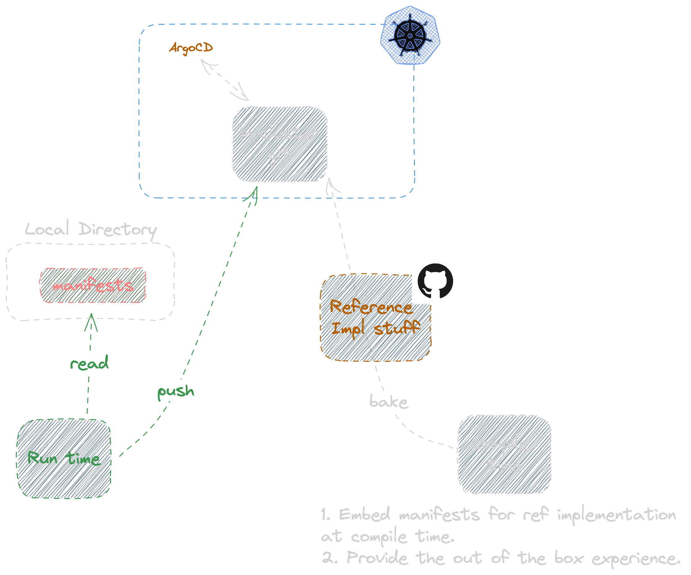

# Pluggable and configurable packaging proposal

## Background

`idpbuilder` is a tool that aims to:
- Allow developers to stand up a Kubernetes cluster with components that make up a Internal Developer Platform (IDP). 
- Allow for tests to run against IDPs in Continuous Integration systems.
- Standup a working IDP for demo purposes.

It also aims to achieve the above goals while having a single dependency, Docker, at run time. 

When implementing IDPs using open source projects, there is no one set of projects that fit the needs of all organizations because:
1. No organization went through the same path to reach the point of needing a IDP.
1. Past technology choices were made for specific needs of each organization. This results in organizationally unique technology inertia that may not be correctable in the near future.
1. No industry consensus and standards for choosing specific IDP components.

To fit the needs from different organizations, idpbuilder needs to be flexible in the what and how it can deploy different packages. Currently idpbuilder uses ArgoCD to install a [set of application](https://github.com/cnoe-io/idpbuilder/blob/56089e4ae3b27cf90641bfbff2a96c36dd5263e1/pkg/apps/resources.go#L20-L32), and they cannot be changed without modifying the source code.

In addition, the git server uses Go's embed capability to serve contents to ArgoCD.  Because of this, to update package configurations in idpbuilder, it requires compiling the Go application. For Go developers this approach is straightforward to work with. For non-Go developers, this approach may be frustrating when needing to debug errors from an unfamiliar language while compiling the program.

## Goals

The proposal in this document should:

1. Make the packages installed by `idpbuilder` configurable.
1. Minimize the number of runtime dependencies necessary.
1. Define an easy way to declare the packages to be installed.
1. Allow for fast local development feedback loop.

## Proposal

This document proposes the following:
- Make ArgoCD a hard requirement for now.
- Define packages as Argo CD Applications (Helm, Kustomize, and raw manifests)
- Use a more configurable Git server, Gitea. 
- Imperative pipelines for configuring packages are handled with ArgoCD resource hooks.

In this implementation, we will make ArgoCD the technology of choice. However, we will strive to maintain separation between packages and specific CD technologies (Argo) to allow for future CD plug-ability.



### Essential Packages

For `idpbuilder` to make the cluster ready to be used for non-essential packages, it must install:

1. In-cluster git server
2. ArgoCD
3. Ingress for git server and ArgoCD

Once they are installed and ready, the manifests used should be pushed to an in-cluster git repository.
The packages then can be managed by ArgoCD from that point. 
This allows for end users to make changes to them through GitOps by either using the Git UI or locally through Git pull / push.  

### ArgoCD

Currently, ArgoCD is a base requirement for both the AWS reference implementation and idpbuilder but not yet officially made a hard requirement. ArgoCD is the CD of choice for CNOE members and it should be the focus over other GitOps solutions. 
Packages then become the formats that ArgoCD supports natively: Helm charts, Kustomize, and raw manifests.

#### Support for imperative pipelines

Regardless of how applications are delivered declaratively, custom scripts are often needed before, during, and after application syncing to ensure applications reach the desired state. idpbuilder needs to provide a way to run custom scripts in a defined order. 

We could define a spec to support such cases, but considering the main use cases of idpbuilder center around everything being local, it doesn't require overly complex tasks. For example, in the reference implementation for AWS, the majority of scripting are done to manage authentication mechanisms. Another task that the scripts do is domain name configuration for each package such as setting the `baseUrl` field in the Backstage configuration file. In local environments, tasks like these are likely unnecessary because authentication is not necessary and domain names are predictable.

ArgoCD supports resource hooks which allow users to define tasks to be run during application syncing. While there are some limitations to what it can do, for the majority of simple tasks resource hooks should suffice.

### The in-cluster git server

The primary purpose of the in-cluster git server is to sync local files to it, then make them available for ArgoCD to use.

As documented in [this issue](https://github.com/cnoe-io/idpbuilder/issues/32), using `gitea` offers more configurable and user friendly experience. In short, using it enables:
- Git UI and ssh access for end users.
- More configurable git server.
- Include the source control system as a core component for a developer platform.
- Move the outdated git dependency to a more modern and actively supported dependency.

`gittea` offers installation into Kubernetes cluster using a helm chart. It should be leveraged to install it to the local cluster. The ideal way to install this would be to use ArgoCD. However, ArgoCD requires a Git server to read Helm values from. It is possible to host the values file on a public repository, but the idpbuilder core components should avoid depending on external systems. In secured environments, it may be impossible for ArgoCD to reach the public repository.

It should follow the same pattern of installing ArgoCD by embedding them in the application binary. The manifests should be rendered at build time by using the `helm template` command with values checked into the repository.

In case the embedded configuration does not work for some reason, we should provide a flag, `--git-manifest-file`. When used, it specifies a single file that contains manifests necessary to configure a git server. 

It is important to note that the file contains raw manifests that will be applied as-is, not helm values. Supporting manifest rendering mechanisms come with a cost of needing to include and maintain libraries and light logic to render these manifests. One of the goals of this proposal is to minimize dependencies.
It's also difficult to ensure rendered manifests are what users intended to use. Users may have different versions of helm from our version. This may cause slight differences in manifests due to a bug or a feature differences.
Users are expected to run the `helm template` command to generate manifests.


### Runtime Git server content generation

As mentioned earlier, Git server contents are generated at compile time and cannot be changed at run time.
To solve this, Git content should be created at run time by introducing a new flag, `--package-dir`, to idpbuilder. This flag takes a directory that contains ArgoCD Applications. 
If this flag is not specified, use the embedded FS to provide the "default experience" where it uses the manifests provided at compile time to bootstrap and add predetermined packages to the cluster.

Because Helm and Kustomize can reference remote repositories, this approach introduces a use case where secrets must be passed to the cluster from local machine. Kubernetes resource YAML files are often stored on a private Git server and require credentials to access. For ArgoCD to access the Git server, the credentials must be passed to ArgoCD as Kubernetes Secrets. 

To accomplish this, idpbuilder will provide a flag to pass secrets and other ArgoCD configuration options. `--argocd-config` flag should point to a directory with manifests for configuring ArgoCD, ConfigMaps and Secrets. These manifests will be applied after ArgoCD is deployed and ready. An example directory contents are shown below.

```yaml
# --argocd-config ./configs
apiVersion: v1
kind: Secret
metadata:
  name: argo-helm
  namespace: argocd
  labels:
    argocd.argoproj.io/secret-type: repository
stringData:
  name: argo
  url: https://argoproj.github.io/argo-helm
  type: helm
  username: my-username
  password: my-password
---
apiVersion: v1
kind: ConfigMap
metadata:
  name: argocd-cm
  namespace: argocd
  labels:
    app.kubernetes.io/name: argocd-cm
    app.kubernetes.io/part-of: argocd
data:
  url: https://argo-cd-demo.argoproj.io

```


#### Local file handling

To allow for faster feedback loop when developing Kubernetes applications and manifests, idpbuilder should support pushing local files to the in-cluster git repository if sources are specified using `files://`. 
Given the following application:

```yaml
apiVersion: argoproj.io/v1alpha1
kind: Application
spec:
  sources:
    - path: argo-workflows
      repoURL: "files://test-package"
      targetRevision: HEAD
```

idpbuilder must:
  * Take and validate all manifests under the `test-package` directory. 
  * Create a new repository in the in-cluster git server.
  * Push the files to the repository.
  * Replace `files://` with `https://git-server.git.svc.cluster.local`


## Future improvements

- Extend support for using different tools for CD and imperative workflows. For example, we may consider supporting Tekton or Flagger for running imperative workflows.
- Extend support for other GitOps solutions such as Flux CD.
- Add support for authentication. As use cases grow, it will be necessary to support authentication mechanisms. Example use cases: GitHub credentials for ArgoCD, AWS credentials to pull images from a ECR registry.
- Add support for capturing Kubernetes job outputs that were launched by ArgoCD Resource Hooks. Stdout and stderr are not saved for completed jobs by default. This will help debug problems when running imperative commands in Kubernetes Jobs.
- Support for ArgoCD App of Apps. An App of Apps is an ArgoCD application that contains other ArgoCD applications. Support for this would require: 
    - Rendering Helm charts and Kustomize.
    - Sync repository contents, then parse and replace URLs as described above. 
    

## Alternatives Considered

#### Use OCI images as applications

Projects such as Sealer and Kapp aim to use OCI images as the artifact to define and deploy multiple Kubernetes resources. This has a few advantages. 

- Immutable single artifact that can be used to deploy to different clusters.
- Simplicity. Application dependencies and supporting resources are defined and confined in the image.
- Can use standard Kubernetes YAML files, Helm Charts, and Kustomize. 
- Native support for signing and verification through industry standard tools like cosign.

In addition, both tools support applying changes in particular order. For example, you can run a Kubernetes Job to migrate database schema before rolling out a new image. 

Since many of the goals are covered by both projects, it is possible to incorporate some of their tools and libraries to implement our goals. 

While this approach addresses most of our goals, there are drawbacks.

Firstly, it introduces a new layer for end users to debug. For end users to debug an issue related to Kubernetes manifest rendering, they now need to:
1. Figure out which OCI image contains the package with the problem. The problem may reside in one of dependent OCI images. 
2. Extract the contents of the OCI image. Determine which one file is responsible for the issue. 
3. Correct the issue.
4. Publish a new image.

Secondly, these tools and using OCI images as packages are not well adopted by CNOE members as evidenced by the tech radar. idpbuilder should be useful and relevant to CNOE members.

#### Define specs for imperative work

To support use cases where more complex steps are needed to orchestrate different services in to the cluster, idpbuilder could define a configuration spec where end users can define their own steps. For example, a spec may look something like the following. 

```yaml
apiVersion: idpbuilder.cnoe.io/v1alpha1
kind: Config
metadata:
  name: test
spec:
  packages:
    - name: crossplane
      preCreation:
        - name: job1
          secretRef:
            name: job1
            path: ./secret1
          type: helm
          chart:
            values: ./values.yaml
            url: "https://somewhere.cnoe.io/charts"
          spec:
            apiVersion: batch/v1
            kind: Job
            metadata:
              name: pi
      postCreation:
        ...

```

This introduces a few problems. 

1. Complexity.

    This introduces a completely new mechanisms to manage applications. Current idpbuilder design is very simple with no concept of pipelining. It allows end users to define manifests at compile time, and apply them as Argo CD applications. Introducing this feature and maintaining it may involve significant time commitment.


2. Yet another configuration format.

    With the explosion of Kubernetes based projects, a large number of configuration formats were created. Developers and operators are already needing to write and manage configuration files that look similar but slightly different.
  
3. No clear needs for task orchestration capabilities.

    We have so far not had a request for this capability with concrete needs and investing time and effort to implement and maintain this feature doesn't work.

#### Git Repository Mirroring

Another approach is to mirror contents from repositories using credentials from local machine, then push them to the in-cluster git server. This does not require credentials to be replicated to the cluster. A few consideration for this approach: 

1. Kustomize references to private remotes.
    kustomize can reference remote repositories:
    
    ```yaml
      # kustomization.yaml
      resources:
      - https://github.com/kubernetes-sigs/kustomize//examples/multibases?timeout=120&ref=v3.3.1
      namePrefix: remote-
    ```
    
    In this example, to ensure the local git server has everything ArgoCD needs, idpbuilder must:
      * Pull manifests from `github.com/kubernetes-sigs/kustomize`
      * Create a new repository in in-cluster git server.
      * Push contents to the in-cluster repository.
      * Replace `github.com` with `git-server.git.svc.cluster.local`

2. Helm subcharts from private repositories.
    Helm subcharts may look like
    ```
    # Chart.yaml
    dependencies:
    - name: nginx
      version: "1.2.3"
      repository: "https://example.com/charts"
    ```
    In this example, idpbuilder must:
      * Pull `chart.tgz` for the nginx chart.
      * Push it to a in-cluster http server.
      * Replace `example.com` with `http-endpoint.git.svc.cluster.local`

Given the complexity involved with this approach, the first iteration should focus on passing secrets to ArgoCD. When concrete use cases arise, approaches similar to this should be considered.

###### ArgoCD Application handling

Consider a case where idpbuilder is given the flag `--package-dir ./packages`, and the `packages` directory contains a yaml file for a ArgoCD application.

```yaml
apiVersion: argoproj.io/v1alpha1
kind: Application
spec:
  sources:
    - chart: argo-workflows
      repoURL: https://argoproj.github.io/argo-helm
      targetRevision: 0.31.0
      helm:
        releaseName: argo-workflows
        valueFiles:
          - $values/packages/argo-workflows/dev/values.yaml
    - repoURL: https://github.com/cnoe-io/argo-helm
      targetRevision: HEAD
      ref: values
```

In the above file, it instructs ArgoCD to use the charts from `argoproj.github.io/argo-helm` and use values stored at `https://github.com/cnoe-io/argo-helm/packages/argo-workflows/dev/values.yaml`


In this case, idpbuilder must: 

  * Replace `argoproj.github.io` with `http-endpoint.git.svc.cluster.local`.
  * Replace `github.com` with `git-server.git.svc.cluster.local`.
