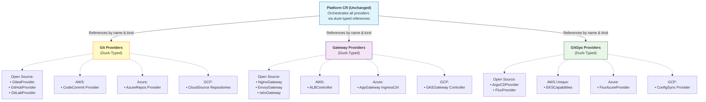

# Hyperscaler Provider Implementation Specification

**Version:** 1.0 Draft  
**Date:** December 20, 2025  
**Status:** Proposal  
**Authors:** IDP Builder Team  
**Builds On:** [Controller-Based Architecture Specification](./controller-architecture-spec.md)

## Executive Summary

This specification extends the [Controller-Based Architecture Specification](./controller-architecture-spec.md) by defining how major cloud hyperscalers (AWS, Azure, GCP) can implement native providers for the core duck-typed interfaces: Git Provider, Gateway Provider, and GitOps Provider. By leveraging native cloud infrastructure services, these implementations enable idpbuilder to run seamlessly in managed Kubernetes environments while utilizing each cloud provider's native capabilities.

**Key Highlights**:
- **AWS** implements all three provider types using CodeCommit, Application Load Balancer Controller, and **EKS Capabilities** (a unique GitOps solution)
- **Azure** implements providers using Azure DevOps Repos, Application Gateway Ingress Controller, and Flux (pre-configured for Azure)
- **GCP** implements providers using Cloud Source Repositories, GKE Gateway Controller, and Config Sync
- All implementations adhere to the duck-typed status field contracts defined in the base architecture specification
- Hyperscaler providers can be mixed with open-source providers (e.g., use AWS CodeCommit with ArgoCD)

## Goals

1. **Cloud-Native Integration**: Enable idpbuilder to leverage native cloud services when deployed on managed Kubernetes (EKS, AKS, GKE)
2. **Provider Flexibility**: Allow platform teams to choose hyperscaler providers based on organizational standards and existing cloud investments
3. **Duck-Type Compliance**: Ensure all hyperscaler providers implement the standard duck-typed interfaces for seamless interoperability
4. **Unique Cloud Features**: Expose unique capabilities of each cloud (e.g., AWS EKS Capabilities for GitOps)
5. **Mixed Deployments**: Support hybrid configurations mixing hyperscaler and open-source providers (e.g., AWS CodeCommit + ArgoCD)
6. **Production Readiness**: Leverage managed services for HA, security, and operational excellence

## Use Cases

### Use Case 1: AWS-Native Platform on EKS
**Scenario**: Enterprise running on AWS EKS wants to use AWS-native services exclusively

**Configuration**:
- **Git Provider**: AWS CodeCommit (fully managed Git repositories)
- **Gateway Provider**: AWS Load Balancer Controller (native ALB/NLB integration)
- **GitOps Provider**: AWS EKS Capabilities (EKS-native GitOps solution)

**Benefits**:
- Single vendor support contract
- IAM-based authentication and authorization
- Native CloudWatch integration for monitoring
- Compliance with AWS security standards

### Use Case 2: Azure-Native Platform on AKS
**Scenario**: Enterprise on Azure AKS following Azure Well-Architected Framework

**Configuration**:
- **Git Provider**: Azure DevOps Repos (Enterprise-grade Git with pipelines)
- **Gateway Provider**: Azure Application Gateway Ingress Controller (WAF, SSL offloading)
- **GitOps Provider**: Flux (pre-configured with Azure integrations)

**Benefits**:
- Integration with Azure Active Directory
- Azure Monitor and Application Insights
- Network security with Application Gateway WAF
- Azure Policy compliance

### Use Case 3: GCP-Native Platform on GKE
**Scenario**: Enterprise on GCP GKE utilizing Google Cloud services

**Configuration**:
- **Git Provider**: Cloud Source Repositories (integrated with Cloud Build)
- **Gateway Provider**: GKE Gateway Controller (native Gateway API support)
- **GitOps Provider**: Config Sync (GKE native GitOps)

**Benefits**:
- Integration with Google Cloud IAM and Workload Identity
- Cloud Operations for GKE (formerly Stackdriver)
- Native Gateway API support
- Google Cloud security scanning

### Use Case 4: Multi-Cloud Hybrid Platform
**Scenario**: Platform team wants flexibility to support multiple clouds while maintaining consistency

**Configuration**:
- **Git Providers**: GitHub (portable across all clouds)
- **Gateway Providers**: Cloud-native (ALB on AWS, App Gateway on Azure, GKE Gateway on GCP)
- **GitOps Provider**: ArgoCD (portable, with cloud-specific integrations)

**Benefits**:
- Consistent Git and GitOps experience across clouds
- Cloud-native ingress for optimal performance
- Flexibility to move workloads between clouds
- Hybrid and multi-cloud support

### Use Case 5: AWS with Open Source GitOps
**Scenario**: AWS shop that wants to use AWS infrastructure but prefers ArgoCD for GitOps

**Configuration**:
- **Git Provider**: AWS CodeCommit
- **Gateway Provider**: AWS Load Balancer Controller
- **GitOps Provider**: ArgoCD (with AWS integrations)

**Benefits**:
- Best of both worlds: AWS infrastructure + popular open-source GitOps
- Demonstrates duck-typing flexibility
- Team expertise with ArgoCD preserved

## Architecture Overview

### Hyperscaler Provider Integration

The hyperscaler providers integrate seamlessly into the existing controller-based architecture by implementing the same duck-typed status fields as their open-source counterparts:



**All providers expose standard duck-typed status fields:**

| Provider Type | Status Fields |
|---------------|---------------|
| **Git Providers** | • endpoint<br/>• internalEndpoint<br/>• credentialsRef |
| **Gateway Providers** | • ingressClassName<br/>• loadBalancerEndpoint<br/>• internalEndpoint |
| **GitOps Providers** | • endpoint<br/>• internalEndpoint<br/>• credentialsRef |

### Cloud Provider IAM Integration

Each hyperscaler provider leverages native IAM mechanisms:

- **AWS**: Uses IAM Roles for Service Accounts (IRSA) for pod-level permissions
- **Azure**: Uses Azure AD Workload Identity for managed identity assignment
- **GCP**: Uses Workload Identity for Google Cloud IAM integration

This eliminates the need for long-lived credentials in most scenarios.


## AWS Provider Implementations

### AWS CodeCommit Provider (Git)

AWS CodeCommit is a fully managed source control service that hosts secure Git repositories.

#### CodeCommitProvider CRD

```yaml
apiVersion: idpbuilder.cnoe.io/v1alpha1
kind: CodeCommitProvider
metadata:
  name: codecommit-primary
  namespace: idpbuilder-system
spec:
  # AWS Region where repositories will be created
  region: us-east-1
  
  # Authentication method
  auth:
    # Use IAM Role for Service Accounts (IRSA) - recommended
    type: IRSA
    serviceAccountName: codecommit-provider-sa
    roleArn: arn:aws:iam::123456789012:role/CodeCommitProviderRole
    
    # Alternative: Use IAM credentials from secret
    # type: IAMCredentials
    # credentialsSecretRef:
    #   name: aws-credentials
    #   namespace: idpbuilder-system
  
  # Repository naming convention
  repositoryPrefix: idp-  # Repositories will be named: idp-<name>
  
  # Default repository configuration
  repositoryDefaults:
    # Repository description template
    description: "IDP Builder managed repository"
    
    # Tags to apply to all repositories
    tags:
      managed-by: idpbuilder
      environment: production
    
    # Triggers and notifications
    enableCloudWatchEvents: true
    enableSNSNotifications: false
  
  # Git user configuration for commits
  gitUser:
    name: IDP Builder
    email: idpbuilder@example.com

status:
  conditions:
    - type: Ready
      status: "True"
      lastTransitionTime: "2025-12-20T10:00:00Z"
      reason: IAMValidated
      message: "CodeCommit provider ready with IRSA authentication"
  
  # Duck-typed fields (REQUIRED for Git Provider interface)
  endpoint: https://git-codecommit.us-east-1.amazonaws.com
  internalEndpoint: https://git-codecommit.us-east-1.amazonaws.com
  credentialsSecretRef:
    name: codecommit-git-credentials
    namespace: idpbuilder-system
    key: credentials  # Contains Git credentials helper config
  
  # AWS-specific status
  region: us-east-1
  accountId: "123456789012"
  authenticated: true
  iamRole: arn:aws:iam::123456789012:role/CodeCommitProviderRole
```

#### Key Features

1. **IRSA Integration**: Controller uses IAM Role for Service Accounts to assume an IAM role with CodeCommit permissions
2. **Repository Management**: Creates and manages CodeCommit repositories via AWS SDK
3. **Git Credentials**: Generates Git credentials for use by GitRepository CR and other consumers
4. **CloudWatch Integration**: Optional integration with CloudWatch Events for repository activity monitoring
5. **Tagging**: Applies AWS resource tags for cost allocation and governance

### AWS Load Balancer Controller Provider (Gateway)

The AWS Load Balancer Controller manages AWS Elastic Load Balancers for Kubernetes clusters.

#### AWSLoadBalancerProvider CRD

```yaml
apiVersion: idpbuilder.cnoe.io/v1alpha1
kind: AWSLoadBalancerProvider
metadata:
  name: aws-alb
  namespace: idpbuilder-system
spec:
  # Deployment namespace for the controller
  namespace: kube-system
  
  # Controller version
  version: v2.8.1
  
  # Installation method
  installMethod:
    type: Helm
    helm:
      repository: https://aws.github.io/eks-charts
      chart: aws-load-balancer-controller
      version: 1.8.1
  
  # AWS-specific configuration
  aws:
    # AWS Region
    region: us-east-1
    
    # VPC ID (auto-detected if not specified)
    vpcId: vpc-0123456789abcdef0
    
    # EKS Cluster name
    clusterName: my-eks-cluster
    
    # IAM Role for Service Account
    serviceAccount:
      create: true
      name: aws-load-balancer-controller
      annotations:
        eks.amazonaws.com/role-arn: arn:aws:iam::123456789012:role/AWSLoadBalancerControllerRole
  
  # Load balancer configuration
  loadBalancer:
    # Default type: alb (Application Load Balancer) or nlb (Network Load Balancer)
    type: alb
    
    # Default scheme: internet-facing or internal
    scheme: internet-facing
    
    # Target type: ip (for Fargate) or instance
    targetType: ip
    
    # SSL policy
    sslPolicy: ELBSecurityPolicy-TLS13-1-2-2021-06
    
    # Tags for created load balancers
    tags:
      managed-by: idpbuilder
      kubernetes.io/cluster/my-eks-cluster: owned
  
  # IngressClass configuration
  ingressClass:
    name: alb
    isDefault: true
  
  # WAF integration (optional)
  waf:
    enabled: false
    # webACLArn: arn:aws:wafv2:us-east-1:123456789012:global/webacl/...

status:
  conditions:
    - type: Ready
      status: "True"
      lastTransitionTime: "2025-12-20T10:00:00Z"
  
  # Duck-typed fields (REQUIRED for Gateway Provider interface)
  ingressClassName: alb
  loadBalancerEndpoint: my-alb-1234567890.us-east-1.elb.amazonaws.com
  internalEndpoint: http://aws-load-balancer-webhook-service.kube-system.svc.cluster.local
  
  # AWS-specific status
  installed: true
  version: v2.8.1
  phase: Ready
  controllerDeployment:
    ready: true
    replicas: 2
  vpcId: vpc-0123456789abcdef0
  loadBalancers:
    - name: my-alb-1234567890
      arn: arn:aws:elasticloadbalancing:us-east-1:123456789012:loadbalancer/app/...
      dnsName: my-alb-1234567890.us-east-1.elb.amazonaws.com
      scheme: internet-facing
```

#### Key Features

1. **Native ALB/NLB Support**: Creates AWS Application or Network Load Balancers
2. **Target Group Binding**: Manages target groups and health checks
3. **WAF Integration**: Optional AWS WAF integration for security
4. **Certificate Management**: Integrates with AWS Certificate Manager (ACM)
5. **Cost Optimization**: Supports IP target type for Fargate cost efficiency

### AWS EKS Capabilities Provider (GitOps) - UNIQUE TO AWS

**EKS Capabilities** is an AWS-native GitOps solution that provides declarative cluster management for Amazon EKS. It is the only hyperscaler-unique GitOps provider in this specification.

**Reference**: https://docs.aws.amazon.com/eks/latest/userguide/capabilities.html

> **Note**: This specification documents EKS Capabilities based on the problem statement reference. If this AWS feature is not yet publicly available or is in preview, this section represents a proposed design for how an AWS-native GitOps provider could integrate with the idpbuilder architecture. Alternative AWS GitOps implementations could use:
> - **Flux** with AWS-specific integrations (CodeCommit, IRSA, CloudWatch)
> - **ArgoCD** with AWS-specific integrations (similar to open-source but with AWS optimizations)
> - Future AWS-managed GitOps solutions as they become available
>
> Platform teams should verify the current availability of EKS Capabilities and choose an appropriate GitOps provider for their AWS deployments.


#### EKSCapabilitiesProvider CRD

```yaml
apiVersion: idpbuilder.cnoe.io/v1alpha1
kind: EKSCapabilitiesProvider
metadata:
  name: eks-capabilities
  namespace: idpbuilder-system
spec:
  # EKS Cluster configuration
  cluster:
    name: my-eks-cluster
    region: us-east-1
  
  # Git repository configuration for cluster capabilities
  gitRepository:
    # Git provider reference (can be CodeCommit, GitHub, etc.)
    providerRef:
      name: codecommit-primary
      kind: CodeCommitProvider
      namespace: idpbuilder-system
    
    # Repository containing cluster capabilities manifests
    repository: cluster-capabilities
    branch: main
    path: capabilities/
  
  # Authentication
  auth:
    # Use IAM Role for Service Accounts
    type: IRSA
    serviceAccountName: eks-capabilities-sa
    roleArn: arn:aws:iam::123456789012:role/EKSCapabilitiesRole
  
  # Sync configuration
  sync:
    # Sync interval
    interval: 5m
    
    # Prune resources not in Git
    prune: true
    
    # Auto-sync on Git changes
    autoSync: true
  
  # Capabilities to enable
  capabilities:
    # EKS Add-ons management
    - name: addons
      enabled: true
      config:
        # Automatically manage add-on versions
        autoUpdate: true
        # Add-ons to manage
        addons:
          - vpc-cni
          - kube-proxy
          - coredns
          - aws-ebs-csi-driver
    
    # IAM Roles for Service Accounts (IRSA)
    - name: irsa
      enabled: true
      config:
        # OIDC provider (auto-detected)
        oidcProvider: auto
    
    # Security groups for pods
    - name: security-group-policy
      enabled: true
    
    # Pod Identity (new AWS feature)
    - name: pod-identity
      enabled: true
  
  # Notification configuration
  notifications:
    # SNS topic for sync events
    snsTopicArn: arn:aws:sns:us-east-1:123456789012:eks-capabilities-notifications
    
    # Notify on sync failure
    notifyOnFailure: true
    
    # Notify on successful sync
    notifyOnSuccess: false

status:
  conditions:
    - type: Ready
      status: "True"
      lastTransitionTime: "2025-12-20T10:00:00Z"
      reason: SyncSuccessful
      message: "EKS Capabilities synced successfully from Git"
  
  # Duck-typed fields (REQUIRED for GitOps Provider interface)
  endpoint: https://console.aws.amazon.com/eks/home?region=us-east-1#/clusters/my-eks-cluster
  internalEndpoint: https://eks.us-east-1.amazonaws.com
  credentialsSecretRef:
    name: eks-capabilities-credentials
    namespace: idpbuilder-system
    key: kubeconfig
  
  # AWS-specific status
  installed: true
  phase: Ready
  lastSyncTime: "2025-12-20T10:05:00Z"
  syncStatus: Synced
  syncRevision: abc123def456
  
  # Capabilities status
  capabilities:
    - name: addons
      status: Active
      addons:
        - name: vpc-cni
          version: v1.16.0
          status: Active
        - name: kube-proxy
          version: v1.29.0
          status: Active
    - name: irsa
      status: Active
      oidcProvider: oidc.eks.us-east-1.amazonaws.com/id/EXAMPLED539D4633E53DE1B71EXAMPLE
    - name: security-group-policy
      status: Active
    - name: pod-identity
      status: Active
  
  # Sync statistics
  syncStats:
    totalSyncs: 42
    successfulSyncs: 41
    failedSyncs: 1
    lastFailure: "2025-12-19T15:30:00Z"
```

#### Key Features of EKS Capabilities

1. **EKS-Native GitOps**: Designed specifically for Amazon EKS cluster management
2. **Add-on Management**: Declaratively manages EKS add-ons (VPC CNI, CoreDNS, etc.)
3. **IRSA Support**: Automatic management of IAM Roles for Service Accounts
4. **Security Group Policies**: Declarative security group management for pods
5. **Pod Identity**: Support for AWS Pod Identity (next-generation IRSA)
6. **CloudWatch Integration**: Native integration with CloudWatch for monitoring sync operations
7. **SNS Notifications**: Configurable notifications for sync events

#### Why EKS Capabilities is Unique

Unlike ArgoCD and Flux which are Kubernetes-native GitOps tools that work on any cluster, **EKS Capabilities** is:
- **AWS-only**: Only works on Amazon EKS clusters
- **Deeply Integrated**: Direct integration with EKS APIs and AWS services
- **Cluster-focused**: Designed for cluster-level configuration management
- **Add-on Aware**: Native support for EKS add-on lifecycle management
- **IAM-centric**: First-class support for AWS IAM and security features

This makes it a natural choice for AWS-centric organizations that want deep EKS integration.

## Azure Provider Implementations

### Azure DevOps Repos Provider (Git)

Azure DevOps Repos provides enterprise-grade Git repositories with integrated CI/CD pipelines.

#### AzureReposProvider CRD

```yaml
apiVersion: idpbuilder.cnoe.io/v1alpha1
kind: AzureReposProvider
metadata:
  name: azure-repos-primary
  namespace: idpbuilder-system
spec:
  # Azure DevOps organization
  organization: my-organization
  
  # Azure DevOps project
  project: idp-platform
  
  # Authentication
  auth:
    # Use Azure AD Workload Identity (recommended)
    type: WorkloadIdentity
    serviceAccountName: azure-repos-provider-sa
    tenantId: 12345678-1234-1234-1234-123456789012
    clientId: 87654321-4321-4321-4321-210987654321
    
    # Alternative: Personal Access Token
    # type: PAT
    # credentialsSecretRef:
    #   name: azure-devops-pat
    #   namespace: idpbuilder-system
    #   key: token
  
  # Repository defaults
  repositoryDefaults:
    # Enable branch policies
    branchPolicies:
      enabled: true
      requireReviewers: 1
      requireBuildValidation: false
    
    # Enable pull request work items
    requireWorkItemLinks: false
    
    # Default branch name
    defaultBranch: main
  
  # Git user configuration
  gitUser:
    name: IDP Builder
    email: idpbuilder@example.com

status:
  conditions:
    - type: Ready
      status: "True"
      lastTransitionTime: "2025-12-20T10:00:00Z"
  
  # Duck-typed fields (REQUIRED for Git Provider interface)
  endpoint: https://dev.azure.com/my-organization/idp-platform/_git
  internalEndpoint: https://dev.azure.com/my-organization/idp-platform/_apis/git
  credentialsSecretRef:
    name: azure-repos-git-credentials
    namespace: idpbuilder-system
    key: credentials
  
  # Azure-specific status
  organization: my-organization
  project: idp-platform
  projectId: a1b2c3d4-e5f6-7890-abcd-ef1234567890
  authenticated: true
  tenantId: 12345678-1234-1234-1234-123456789012
```

#### Key Features

1. **Azure AD Integration**: Uses Azure AD Workload Identity for secure authentication
2. **Branch Policies**: Declarative branch protection and pull request policies
3. **Work Item Integration**: Links Git commits to Azure Boards work items
4. **Pipeline Integration**: Native integration with Azure Pipelines
5. **Enterprise Security**: Supports Azure security policies and compliance requirements

### Azure Application Gateway Ingress Controller Provider (Gateway)

The Application Gateway Ingress Controller (AGIC) uses Azure Application Gateway for ingress traffic.

#### AzureAppGatewayProvider CRD

```yaml
apiVersion: idpbuilder.cnoe.io/v1alpha1
kind: AzureAppGatewayProvider
metadata:
  name: azure-appgw
  namespace: idpbuilder-system
spec:
  # Deployment namespace
  namespace: kube-system
  
  # Controller version
  version: 1.7.0
  
  # Installation method
  installMethod:
    type: Helm
    helm:
      repository: https://appgwingress.blob.core.windows.net/ingress-azure-helm-package/
      chart: ingress-azure
      version: 1.7.0
  
  # Azure Application Gateway configuration
  applicationGateway:
    # Existing Application Gateway resource ID
    resourceId: /subscriptions/12345678-1234-1234-1234-123456789012/resourceGroups/my-rg/providers/Microsoft.Network/applicationGateways/my-appgw
    
    # Or create new Application Gateway
    # create: true
    # name: idp-appgw
    # sku:
    #   name: WAF_v2
    #   tier: WAF_v2
    #   capacity: 2
  
  # AKS cluster configuration
  cluster:
    subscriptionId: 12345678-1234-1234-1234-123456789012
    resourceGroup: my-rg
    name: my-aks-cluster
  
  # Authentication
  auth:
    # Use Azure AD Workload Identity
    type: WorkloadIdentity
    serviceAccountName: agic-sa
    tenantId: 12345678-1234-1234-1234-123456789012
    clientId: 87654321-4321-4321-4321-210987654321
  
  # IngressClass configuration
  ingressClass:
    name: azure-application-gateway
    isDefault: true
  
  # WAF configuration
  waf:
    enabled: true
    mode: Prevention  # Detection or Prevention
    ruleSetType: OWASP
    ruleSetVersion: "3.2"

status:
  conditions:
    - type: Ready
      status: "True"
      lastTransitionTime: "2025-12-20T10:00:00Z"
  
  # Duck-typed fields (REQUIRED for Gateway Provider interface)
  ingressClassName: azure-application-gateway
  loadBalancerEndpoint: my-appgw-12345.eastus.cloudapp.azure.com
  internalEndpoint: http://agic-controller.kube-system.svc.cluster.local
  
  # Azure-specific status
  installed: true
  version: 1.7.0
  phase: Ready
  applicationGateway:
    resourceId: /subscriptions/.../applicationGateways/my-appgw
    publicIp: 20.30.40.50
    fqdn: my-appgw-12345.eastus.cloudapp.azure.com
    provisioningState: Succeeded
  wafEnabled: true
  wafMode: Prevention
```

#### Key Features

1. **WAF Protection**: Built-in Web Application Firewall for security
2. **SSL Offloading**: Terminates SSL at the Application Gateway
3. **Azure Integration**: Native integration with Azure Virtual Network, Azure Monitor
4. **Autoscaling**: Supports Application Gateway v2 autoscaling
5. **Multi-site Hosting**: Supports routing based on hostname and path

### Flux Azure Provider (GitOps)

Flux is pre-configured with Azure-specific integrations for AKS environments.

#### FluxAzureProvider CRD

```yaml
apiVersion: idpbuilder.cnoe.io/v1alpha1
kind: FluxAzureProvider
metadata:
  name: flux-azure
  namespace: idpbuilder-system
spec:
  # Deployment namespace
  namespace: flux-system
  
  # Flux version
  version: v2.4.0
  
  # Installation method
  installMethod:
    type: Helm
    helm:
      repository: https://fluxcd-community.github.io/helm-charts
      chart: flux2
      version: 2.14.0
  
  # Azure-specific configuration
  azure:
    # Tenant ID
    tenantId: 12345678-1234-1234-1234-123456789012
    
    # Azure DevOps integration (if using Azure Repos)
    devops:
      enabled: true
      organization: my-organization
      project: idp-platform
    
    # Azure Key Vault integration for secrets
    keyVault:
      enabled: true
      name: my-keyvault
      tenantId: 12345678-1234-1234-1234-123456789012
    
    # Azure Monitor integration
    monitor:
      enabled: true
      workspaceId: 12345678-90ab-cdef-1234-567890abcdef
  
  # Authentication
  auth:
    # Use Azure AD Workload Identity
    type: WorkloadIdentity
    serviceAccountName: flux-sa
    clientId: 87654321-4321-4321-4321-210987654321
  
  # Flux components configuration
  components:
    sourceController:
      enabled: true
    kustomizeController:
      enabled: true
    helmController:
      enabled: true
    notificationController:
      enabled: true
    imageReflectionController:
      enabled: false
    imageAutomationController:
      enabled: false

status:
  conditions:
    - type: Ready
      status: "True"
      lastTransitionTime: "2025-12-20T10:00:00Z"
  
  # Duck-typed fields (REQUIRED for GitOps Provider interface)
  endpoint: https://portal.azure.com/#view/HubsExtension/BrowseResource/resourceType/Microsoft.ContainerService%2FmanagedClusters
  internalEndpoint: http://source-controller.flux-system.svc.cluster.local
  credentialsSecretRef:
    name: flux-azure-credentials
    namespace: flux-system
    key: token
  
  # Azure-specific status
  installed: true
  version: v2.4.0
  phase: Ready
  azure:
    keyVaultIntegration: Active
    monitorIntegration: Active
  controllers:
    sourceController:
      ready: true
    kustomizeController:
      ready: true
    helmController:
      ready: true
    notificationController:
      ready: true
```

#### Key Features

1. **Azure DevOps Integration**: Native support for Azure Repos
2. **Key Vault Integration**: Secure secrets management with Azure Key Vault
3. **Azure Monitor**: Native integration for logging and monitoring
4. **Workload Identity**: Uses Azure AD Workload Identity for secure authentication
5. **Azure Policy**: Compatible with Azure Policy for Kubernetes

## GCP Provider Implementations

### Cloud Source Repositories Provider (Git)

Google Cloud Source Repositories provides fully managed, private Git repositories.

#### CloudSourceRepositoriesProvider CRD

```yaml
apiVersion: idpbuilder.cnoe.io/v1alpha1
kind: CloudSourceRepositoriesProvider
metadata:
  name: cloud-source-repos
  namespace: idpbuilder-system
spec:
  # GCP Project ID
  projectId: my-gcp-project
  
  # GCP Region (optional, repositories are global)
  region: us-central1
  
  # Authentication
  auth:
    # Use Workload Identity (recommended)
    type: WorkloadIdentity
    serviceAccountName: cloud-source-repos-sa
    gcpServiceAccount: cloud-source-repos@my-gcp-project.iam.gserviceaccount.com
    
    # Alternative: Service Account Key
    # type: ServiceAccountKey
    # credentialsSecretRef:
    #   name: gcp-credentials
    #   namespace: idpbuilder-system
    #   key: key.json
  
  # Repository naming convention
  repositoryPrefix: idp-
  
  # Cloud Build integration
  cloudBuild:
    enabled: true
    # Automatically create build triggers for new repositories
    autoCreateTriggers: false
  
  # Pub/Sub notifications
  pubsub:
    enabled: true
    topic: cloud-source-repos-notifications
  
  # Git user configuration
  gitUser:
    name: IDP Builder
    email: idpbuilder@my-gcp-project.iam.gserviceaccount.com

status:
  conditions:
    - type: Ready
      status: "True"
      lastTransitionTime: "2025-12-20T10:00:00Z"
  
  # Duck-typed fields (REQUIRED for Git Provider interface)
  endpoint: https://source.developers.google.com/p/my-gcp-project
  internalEndpoint: https://source.developers.google.com/p/my-gcp-project
  credentialsSecretRef:
    name: cloud-source-repos-credentials
    namespace: idpbuilder-system
    key: credentials
  
  # GCP-specific status
  projectId: my-gcp-project
  projectNumber: "123456789012"
  authenticated: true
  serviceAccount: cloud-source-repos@my-gcp-project.iam.gserviceaccount.com
  cloudBuildIntegration: Active
```

#### Key Features

1. **Workload Identity Integration**: Uses GCP Workload Identity for secure authentication
2. **Cloud Build Integration**: Native integration with Cloud Build for CI/CD
3. **Pub/Sub Notifications**: Repository event notifications via Cloud Pub/Sub
4. **IAM Integration**: Fine-grained access control with Cloud IAM
5. **Audit Logging**: Full audit trail with Cloud Audit Logs

### GKE Gateway Controller Provider (Gateway)

GKE Gateway Controller provides native support for the Gateway API on GKE.

#### GKEGatewayProvider CRD

```yaml
apiVersion: idpbuilder.cnoe.io/v1alpha1
kind: GKEGatewayProvider
metadata:
  name: gke-gateway
  namespace: idpbuilder-system
spec:
  # GKE cluster configuration
  cluster:
    projectId: my-gcp-project
    location: us-central1
    name: my-gke-cluster
  
  # Gateway API version
  gatewayApiVersion: v1
  
  # Gateway class configuration
  gatewayClass:
    name: gke-l7-global-external-managed
    # Options:
    # - gke-l7-global-external-managed (Global external HTTPS)
    # - gke-l7-regional-external-managed (Regional external HTTPS)
    # - gke-l7-rilb (Regional internal HTTPS)
    # - gke-l7-gxlb (Global external HTTPS with advanced features)
  
  # Gateway configuration
  gateway:
    # Gateway name
    name: idp-gateway
    
    # Listeners
    listeners:
      - name: http
        protocol: HTTP
        port: 80
      - name: https
        protocol: HTTPS
        port: 443
        tls:
          mode: Terminate
          certificateRefs:
            - name: platform-tls
              namespace: idpbuilder-system
  
  # SSL configuration
  ssl:
    # Use Google-managed certificates
    managedCertificates:
      enabled: true
      domains:
        - "*.idp.example.com"
    
    # Or use Certificate Manager
    # certificateManager:
    #   enabled: true
    #   certificateMapId: projects/my-gcp-project/locations/global/certificateMaps/my-cert-map
  
  # Cloud Armor integration (DDoS protection and WAF)
  cloudArmor:
    enabled: true
    securityPolicyName: idp-security-policy

status:
  conditions:
    - type: Ready
      status: "True"
      lastTransitionTime: "2025-12-20T10:00:00Z"
  
  # Duck-typed fields (REQUIRED for Gateway Provider interface)
  ingressClassName: gke-l7-global-external-managed
  loadBalancerEndpoint: 34.120.50.60
  internalEndpoint: http://gke-gateway.default.svc.cluster.local
  
  # GCP-specific status
  installed: true
  phase: Ready
  gateway:
    name: idp-gateway
    namespace: default
    ready: true
    addresses:
      - type: IPAddress
        value: 34.120.50.60
  gatewayClass: gke-l7-global-external-managed
  sslCertificates:
    - managed: true
      domains:
        - "*.idp.example.com"
      status: Active
  cloudArmorPolicy: idp-security-policy
```

#### Key Features

1. **Native Gateway API**: First-class support for Kubernetes Gateway API
2. **Global Load Balancing**: Multi-region load balancing with Cloud Load Balancing
3. **Google-Managed Certificates**: Automatic SSL certificate provisioning and renewal
4. **Cloud Armor**: DDoS protection and Web Application Firewall
5. **Cloud CDN**: Optional CDN integration for static content
6. **IAP Integration**: Integration with Identity-Aware Proxy for authentication

### Config Sync Provider (GitOps)

Config Sync is GKE's native GitOps solution, part of Anthos Config Management.

#### ConfigSyncProvider CRD

```yaml
apiVersion: idpbuilder.cnoe.io/v1alpha1
kind: ConfigSyncProvider
metadata:
  name: config-sync
  namespace: idpbuilder-system
spec:
  # GKE cluster configuration
  cluster:
    projectId: my-gcp-project
    location: us-central1
    name: my-gke-cluster
  
  # Config Sync version (managed by GKE)
  version: "1.17.0"
  
  # Git repository configuration
  git:
    # Git provider reference
    providerRef:
      name: cloud-source-repos
      kind: CloudSourceRepositoriesProvider
      namespace: idpbuilder-system
    
    # Repository details
    repo: https://source.developers.google.com/p/my-gcp-project/r/cluster-config
    branch: main
    revision: HEAD
    
    # Directory structure
    syncDir: config-sync-root
    policyDir: policies
    
    # Authentication
    auth: gcpserviceaccount
    gcpServiceAccountEmail: config-sync@my-gcp-project.iam.gserviceaccount.com
  
  # Sync configuration
  sync:
    # Sync wait time
    syncWait: 15s
    
    # Source format
    sourceFormat: unstructured  # or 'hierarchy'
    
    # Prevent drift
    preventDrift: true
  
  # Policy Controller (OPA Gatekeeper integration)
  policyController:
    enabled: true
    # Audit interval
    auditIntervalSeconds: 60
    # Template library
    templateLibrary:
      installation: all  # or 'none', 'custom'
  
  # Monitoring
  monitoring:
    enabled: true

status:
  conditions:
    - type: Ready
      status: "True"
      lastTransitionTime: "2025-12-20T10:00:00Z"
      reason: Synced
      message: "Config Sync is healthy and synced"
  
  # Duck-typed fields (REQUIRED for GitOps Provider interface)
  endpoint: https://console.cloud.google.com/kubernetes/config_management
  internalEndpoint: https://gkeconnect.googleapis.com/v1/projects/my-gcp-project/locations/us-central1/gkeClusters/my-gke-cluster
  credentialsSecretRef:
    name: config-sync-credentials
    namespace: config-management-system
    key: token
  
  # GCP-specific status
  installed: true
  version: "1.17.0"
  phase: Synced
  
  sync:
    status: Synced
    commit: abc123def456
    lastSyncTime: "2025-12-20T10:05:00Z"
    errors: 0
  
  policyController:
    status: Active
    violations: 0
  
  # Resource stats
  resourceStats:
    totalResources: 156
    syncedResources: 156
    failedResources: 0
```

#### Key Features

1. **GKE Native**: Deeply integrated with GKE and Anthos
2. **Policy Controller**: Built-in OPA Gatekeeper for policy enforcement
3. **Hierarchical Repos**: Support for hierarchical configuration structure
4. **Multi-Cluster**: Supports syncing configuration across multiple GKE clusters
5. **Cloud Monitoring**: Native integration with Cloud Operations (formerly Stackdriver)
6. **Drift Prevention**: Prevents and alerts on configuration drift

## Interface Definitions (CRDs)

### Common Duck-Typed Status Fields

All provider CRDs MUST implement these duck-typed status fields to ensure interoperability:

#### Git Provider Interface

```go
// All Git providers (open-source and hyperscaler) MUST expose these fields
type GitProviderStatus struct {
    // Standard Kubernetes conditions
    Conditions []metav1.Condition `json:"conditions,omitempty"`
    
    // REQUIRED: External URL for web UI and Git operations
    Endpoint string `json:"endpoint,omitempty"`
    
    // REQUIRED: Cluster-internal URL for API access
    InternalEndpoint string `json:"internalEndpoint,omitempty"`
    
    // REQUIRED: Reference to secret containing Git credentials
    CredentialsSecretRef *SecretReference `json:"credentialsSecretRef,omitempty"`
}
```

**Implementations**:
- Open Source: `GiteaProvider`, `GitHubProvider`, `GitLabProvider`
- AWS: `CodeCommitProvider`
- Azure: `AzureReposProvider`
- GCP: `CloudSourceRepositoriesProvider`

#### Gateway Provider Interface

```go
// All Gateway providers (open-source and hyperscaler) MUST expose these fields
type GatewayProviderStatus struct {
    // Standard Kubernetes conditions
    Conditions []metav1.Condition `json:"conditions,omitempty"`
    
    // REQUIRED: Ingress class name for Ingress resources
    IngressClassName string `json:"ingressClassName,omitempty"`
    
    // REQUIRED: External endpoint for accessing services
    LoadBalancerEndpoint string `json:"loadBalancerEndpoint,omitempty"`
    
    // REQUIRED: Cluster-internal API endpoint
    InternalEndpoint string `json:"internalEndpoint,omitempty"`
}
```

**Implementations**:
- Open Source: `NginxGateway`, `EnvoyGateway`, `IstioGateway`
- AWS: `AWSLoadBalancerProvider`
- Azure: `AzureAppGatewayProvider`
- GCP: `GKEGatewayProvider`

#### GitOps Provider Interface

```go
// All GitOps providers (open-source and hyperscaler) MUST expose these fields
type GitOpsProviderStatus struct {
    // Standard Kubernetes conditions
    Conditions []metav1.Condition `json:"conditions,omitempty"`
    
    // REQUIRED: External URL for web UI
    Endpoint string `json:"endpoint,omitempty"`
    
    // REQUIRED: Cluster-internal API endpoint
    InternalEndpoint string `json:"internalEndpoint,omitempty"`
    
    // REQUIRED: Reference to secret containing admin credentials
    CredentialsSecretRef *SecretReference `json:"credentialsSecretRef,omitempty"`
}
```

**Implementations**:
- Open Source: `ArgoCDProvider`, `FluxProvider`
- AWS: `EKSCapabilitiesProvider` (UNIQUE)
- Azure: `FluxAzureProvider`
- GCP: `ConfigSyncProvider`

### Platform CR Integration

The Platform CR remains unchanged and can reference any provider implementation:

```yaml
apiVersion: idpbuilder.cnoe.io/v1alpha1
kind: Platform
metadata:
  name: aws-production
  namespace: idpbuilder-system
spec:
  domain: idp.example.com
  
  components:
    gitProviders:
      # Reference AWS CodeCommit provider
      - name: codecommit-primary
        kind: CodeCommitProvider
        namespace: idpbuilder-system
    
    gateways:
      # Reference AWS Load Balancer Controller
      - name: aws-alb
        kind: AWSLoadBalancerProvider
        namespace: idpbuilder-system
    
    gitOpsProviders:
      # Reference AWS EKS Capabilities (unique to AWS)
      - name: eks-capabilities
        kind: EKSCapabilitiesProvider
        namespace: idpbuilder-system
```

## Implementation Concerns

*Note: This section will be completed in a follow-up phase as per the problem statement. It will cover:*

- Controller implementation patterns for each hyperscaler provider
- SDK integration requirements (AWS SDK, Azure SDK, GCP SDK)
- IAM/authentication setup procedures
- Testing strategies for hyperscaler integrations
- Cost considerations and optimization
- Security best practices
- Migration paths from open-source to hyperscaler providers
- Troubleshooting and operational runbooks

## Success Criteria

### Functional Criteria

- [ ] All hyperscaler providers implement duck-typed status fields correctly
- [ ] Platform CR successfully orchestrates hyperscaler providers
- [ ] Mixed provider scenarios (e.g., AWS Git + ArgoCD) work seamlessly
- [ ] GitRepository CR works with all Git providers (open-source and hyperscaler)
- [ ] Package CR works with all GitOps providers (open-source and hyperscaler)
- [ ] EKS Capabilities provider successfully manages EKS add-ons and configurations

### Quality Criteria

- [ ] CRD schemas validated and documented
- [ ] Duck-typing verified through integration tests
- [ ] Provider substitution tested (swap providers without breaking Platform)
- [ ] Documentation complete for all provider types
- [ ] Examples provided for each hyperscaler

### Adoption Criteria

- [ ] At least one reference implementation per hyperscaler
- [ ] Community validation of CRD schemas
- [ ] Clear migration path from open-source providers to hyperscaler providers
- [ ] Cost analysis provided for hyperscaler provider usage

## Conclusion

This specification extends the controller-based architecture to support native cloud provider integrations. By implementing the duck-typed status field interfaces, hyperscaler providers enable seamless substitution and mixing of providers while leveraging the unique capabilities of each cloud platform.

**Key Takeaways**:

1. **AWS EKS Capabilities** is documented as a hyperscaler-unique GitOps provider concept for deep EKS integration (subject to AWS feature availability - see note in AWS section)
2. All hyperscaler providers adhere to duck-typed interfaces for interoperability
3. Mixed provider scenarios are fully supported (e.g., AWS CodeCommit + ArgoCD)
4. Each cloud provider's native IAM and security features are leveraged
5. Migration paths exist from open-source to hyperscaler providers

**Next Steps**:

1. Validate AWS EKS Capabilities availability and update specification accordingly
2. Community review and feedback on CRD schemas
3. Reference implementation for AWS providers (starting with CodeCommit)
4. Reference implementation for Azure providers
5. Reference implementation for GCP providers
6. Implementation concerns documentation (Phase 2)
7. Integration testing across provider combinations
8. Cost optimization guidance and best practices

---

**Document Status**: Draft for community review

**Important**: The AWS EKS Capabilities section represents a proposed design based on the problem statement. Platform teams should verify feature availability before implementation.

**Feedback**: Please provide feedback via GitHub issues or discussions in the idpbuilder repository.

## Appendix

### A. Provider Comparison Matrix

| Feature | Open Source Providers | AWS Providers | Azure Providers | GCP Providers |
|---------|----------------------|---------------|-----------------|---------------|
| **Git** | Gitea, GitHub, GitLab | CodeCommit | Azure Repos | Cloud Source Repos |
| **Cost** | Free (self-hosted) or variable | $1/active user/month | Included in Azure DevOps | $1/active user/month |
| **HA** | Manual setup | Managed | Managed | Managed |
| **Auth** | Various | IAM/IRSA | Azure AD/Workload Identity | Cloud IAM/Workload Identity |
| **Integration** | Generic | Deep AWS | Deep Azure | Deep GCP |
| **Gateway** | Nginx, Envoy, Istio | ALB Controller | App Gateway | GKE Gateway |
| **WAF** | Add-on | AWS WAF | Included | Cloud Armor |
| **SSL** | Cert-Manager | ACM | App Gateway + Key Vault | Google-Managed Certs |
| **GitOps** | ArgoCD, Flux | **EKS Capabilities** (unique) | Flux + Azure | Config Sync |
| **Multi-Cluster** | Native support | Multi-cluster capable | Fleet Manager | Anthos |

### B. Cost Considerations

#### AWS CodeCommit Pricing
- $1/active user/month (first 5 users free)
- Storage: $0.06/GB-month (first 50 GB free)
- Git requests: Free (within limits)

#### Azure DevOps Repos Pricing
- Included in Azure DevOps Basic Plan ($6/user/month for first 5 users)
- Unlimited private repos
- Free for open source projects (up to 5 users)

#### GCP Cloud Source Repositories Pricing
- $1/active user/month (up to 5 users)
- $1/project/month (over 5 users)
- Storage: $0.10/GB-month (first 50 GB free)

#### Gateway/Load Balancer Pricing
- **AWS ALB**: ~$0.0225/hour + $0.008/LCU-hour (~$16/month base)
- **Azure App Gateway**: ~$0.125/hour (v2) + data processing (~$90/month base)
- **GCP Cloud Load Balancing**: $0.025/hour (global) + forwarding rules (~$18/month base)

#### GitOps Pricing
- **ArgoCD/Flux**: Free (compute costs only)
- **EKS Capabilities**: Included with EKS (no additional cost)
- **Config Sync**: Included with GKE (part of Anthos features)

### C. Authentication Setup Examples

#### AWS IRSA Setup

```bash
# 1. Create IAM policy for CodeCommit
cat > codecommit-policy.json <<EOF
{
  "Version": "2012-10-17",
  "Statement": [
    {
      "Effect": "Allow",
      "Action": [
        "codecommit:CreateRepository",
        "codecommit:GetRepository",
        "codecommit:ListRepositories",
        "codecommit:GitPush",
        "codecommit:GitPull"
      ],
      "Resource": "*"
    }
  ]
}
EOF

aws iam create-policy \
  --policy-name CodeCommitProviderPolicy \
  --policy-document file://codecommit-policy.json

# 2. Create IAM role with trust relationship for IRSA
eksctl create iamserviceaccount \
  --name codecommit-provider-sa \
  --namespace idpbuilder-system \
  --cluster my-eks-cluster \
  --attach-policy-arn arn:aws:iam::123456789012:policy/CodeCommitProviderPolicy \
  --approve

# 3. Verify service account annotation
kubectl get sa codecommit-provider-sa -n idpbuilder-system -o yaml | grep eks.amazonaws.com/role-arn
```

#### Azure Workload Identity Setup

```bash
# 1. Enable Workload Identity on AKS cluster
az aks update \
  --resource-group my-rg \
  --name my-aks-cluster \
  --enable-oidc-issuer \
  --enable-workload-identity

# 2. Get OIDC issuer URL
OIDC_ISSUER=$(az aks show --resource-group my-rg --name my-aks-cluster --query "oidcIssuerProfile.issuerUrl" -otsv)

# 3. Create Azure AD application
az ad app create --display-name idpbuilder-azure-repos

# 4. Create service principal
APP_ID=$(az ad app list --display-name idpbuilder-azure-repos --query [0].appId -o tsv)
az ad sp create --id $APP_ID

# 5. Create federated identity credential
az ad app federated-credential create \
  --id $APP_ID \
  --parameters '{
    "name": "idpbuilder-azure-repos-federated",
    "issuer": "'$OIDC_ISSUER'",
    "subject": "system:serviceaccount:idpbuilder-system:azure-repos-provider-sa",
    "audiences": ["api://AzureADTokenExchange"]
  }'

# 6. Assign Azure DevOps permissions
SP_ID=$(az ad sp list --display-name idpbuilder-azure-repos --query [0].id -o tsv)
# Note: Azure DevOps permissions are managed separately via Azure DevOps UI or API

# 7. Create and annotate Kubernetes service account
cat <<EOF | kubectl apply -f -
apiVersion: v1
kind: ServiceAccount
metadata:
  name: azure-repos-provider-sa
  namespace: idpbuilder-system
  annotations:
    azure.workload.identity/client-id: $APP_ID
    azure.workload.identity/tenant-id: $(az account show --query tenantId -o tsv)
EOF
```

#### GCP Workload Identity Setup

```bash
# 1. Enable Workload Identity on GKE cluster (if not already enabled)
gcloud container clusters update my-gke-cluster \
  --region=us-central1 \
  --workload-pool=my-gcp-project.svc.id.goog

# 2. Create GCP service account
gcloud iam service-accounts create cloud-source-repos-sa \
  --display-name="Cloud Source Repos Provider SA" \
  --project=my-gcp-project

# 3. Grant Cloud Source Repositories permissions
gcloud projects add-iam-policy-binding my-gcp-project \
  --member="serviceAccount:cloud-source-repos-sa@my-gcp-project.iam.gserviceaccount.com" \
  --role="roles/source.admin"

# 4. Bind Kubernetes SA to GCP SA
gcloud iam service-accounts add-iam-policy-binding \
  cloud-source-repos-sa@my-gcp-project.iam.gserviceaccount.com \
  --role roles/iam.workloadIdentityUser \
  --member "serviceAccount:my-gcp-project.svc.id.goog[idpbuilder-system/cloud-source-repos-sa]"

# 5. Create and annotate Kubernetes service account
cat <<EOF | kubectl apply -f -
apiVersion: v1
kind: ServiceAccount
metadata:
  name: cloud-source-repos-sa
  namespace: idpbuilder-system
  annotations:
    iam.gke.io/gcp-service-account: cloud-source-repos-sa@my-gcp-project.iam.gserviceaccount.com
EOF
```

### D. Mixed Provider Example

#### Example: AWS Infrastructure with ArgoCD (Open Source GitOps)

This demonstrates the flexibility of the duck-typed provider architecture:

```yaml
---
# AWS CodeCommit for Git
apiVersion: idpbuilder.cnoe.io/v1alpha1
kind: CodeCommitProvider
metadata:
  name: codecommit-primary
  namespace: idpbuilder-system
spec:
  region: us-east-1
  auth:
    type: IRSA
    serviceAccountName: codecommit-provider-sa
    roleArn: arn:aws:iam::123456789012:role/CodeCommitProviderRole

---
# AWS ALB for Gateway
apiVersion: idpbuilder.cnoe.io/v1alpha1
kind: AWSLoadBalancerProvider
metadata:
  name: aws-alb
  namespace: idpbuilder-system
spec:
  namespace: kube-system
  version: v2.8.1
  aws:
    region: us-east-1
    clusterName: my-eks-cluster

---
# ArgoCD for GitOps (NOT EKS Capabilities)
apiVersion: idpbuilder.cnoe.io/v1alpha1
kind: ArgoCDProvider
metadata:
  name: argocd
  namespace: idpbuilder-system
spec:
  namespace: argocd
  version: v2.12.0

---
# Platform references all three providers
apiVersion: idpbuilder.cnoe.io/v1alpha1
kind: Platform
metadata:
  name: aws-hybrid
  namespace: idpbuilder-system
spec:
  domain: idp.example.com
  
  components:
    gitProviders:
      - name: codecommit-primary
        kind: CodeCommitProvider
        namespace: idpbuilder-system
    
    gateways:
      - name: aws-alb
        kind: AWSLoadBalancerProvider
        namespace: idpbuilder-system
    
    gitOpsProviders:
      - name: argocd
        kind: ArgoCDProvider
        namespace: idpbuilder-system
```

**Benefits of this Configuration**:
- Leverages AWS-native Git and ingress for optimal AWS integration
- Uses familiar ArgoCD for GitOps operations
- Preserves team expertise with ArgoCD
- Demonstrates provider substitutability via duck-typing

### E. Migration Path Example

#### Migrating from Gitea to AWS CodeCommit

```yaml
# Step 1: Deploy CodeCommit provider alongside existing Gitea
apiVersion: idpbuilder.cnoe.io/v1alpha1
kind: CodeCommitProvider
metadata:
  name: codecommit-primary
  namespace: idpbuilder-system
spec:
  region: us-east-1
  auth:
    type: IRSA
    serviceAccountName: codecommit-provider-sa
    roleArn: arn:aws:iam::123456789012:role/CodeCommitProviderRole

---
# Step 2: Update Platform CR to reference both providers temporarily
apiVersion: idpbuilder.cnoe.io/v1alpha1
kind: Platform
metadata:
  name: localdev
  namespace: idpbuilder-system
spec:
  domain: cnoe.localtest.me
  components:
    gitProviders:
      # Keep both during migration
      - name: gitea-local
        kind: GiteaProvider
        namespace: idpbuilder-system
      - name: codecommit-primary
        kind: CodeCommitProvider
        namespace: idpbuilder-system
    # ... other components
```

**Migration Process**:
1. Deploy CodeCommit provider and wait for Ready status
2. Migrate repository content (one-time sync from Gitea to CodeCommit)
3. Update GitRepository CRs one-by-one to reference CodeCommit
4. Verify each application continues to sync correctly
5. Once all repositories migrated, remove Gitea reference from Platform CR
6. Decommission Gitea provider

### F. Troubleshooting Guide

#### Common Issues and Solutions

**Issue: CodeCommit Provider IRSA Authentication Failing**
```bash
# Check service account annotations
kubectl get sa codecommit-provider-sa -n idpbuilder-system -o yaml

# Check IAM role trust policy
aws iam get-role --role-name CodeCommitProviderRole

# Verify OIDC provider is configured
aws iam list-open-id-connect-providers
```

**Issue: Azure Workload Identity Not Working**
```bash
# Verify OIDC issuer is enabled
az aks show --resource-group my-rg --name my-aks-cluster --query "oidcIssuerProfile"

# Check federated credential
az ad app federated-credential list --id <APP_ID>

# Verify service account labels and annotations
kubectl get sa azure-repos-provider-sa -n idpbuilder-system -o yaml
```

**Issue: GCP Workload Identity Binding Failure**
```bash
# Check Workload Identity pool
gcloud container clusters describe my-gke-cluster --region=us-central1 --format="value(workloadIdentityConfig)"

# Verify IAM policy binding
gcloud iam service-accounts get-iam-policy cloud-source-repos-sa@my-gcp-project.iam.gserviceaccount.com

# Check service account annotation
kubectl get sa cloud-source-repos-sa -n idpbuilder-system -o jsonpath='{.metadata.annotations}'
```

