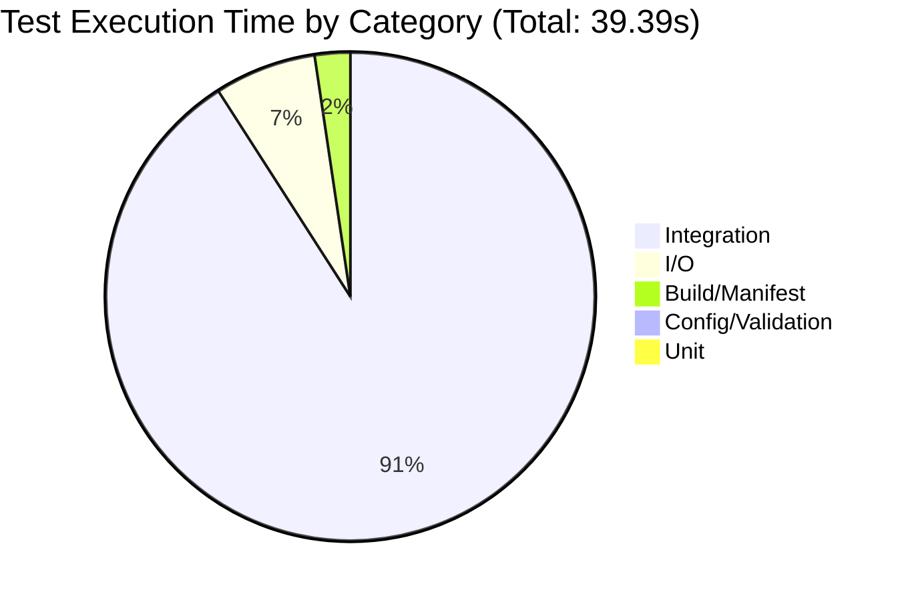

# Test Execution Time Analysis

This report shows the execution times of tests in the idpbuilder project.

## Overview

- **Total Tests**: 62
- **Total Execution Time**: 39.39s

## Slowest Individual Tests

| Rank | Test Name | Time (s) | Package |
|------|-----------|----------|---------|
| 1 | `TestGetGiteaToken` | 35.00 | localbuild |
| 2 | `TestCloneRemoteRepoToDir` | 1.86 | util |
| 3 | `TestBuildCustomizedManifests` | 0.92 | k8s |
| 4 | `TestGetWorktreeYamlFiles` | 0.40 | util |
| 5 | `TestCopyTreeToTree` | 0.38 | util |
| 6 | `TestGetK8sInstallResources` | 0.20 | localbuild |
| 7 | `TestGitRepositoryContentReconcile/files_modified` | 0.12 | gitrepository |
| 8 | `TestGitRepositoryContentReconcile` | 0.12 | gitrepository |
| 9 | `TestGetConfigCustom` | 0.09 | kind |
| 10 | `TestGitRepositoryReconcile` | 0.06 | gitrepository |

## Test Times by Category

Tests are categorized based on their functionality:

| Category | Total Time (s) | Test Count | Avg Time (s) |
|----------|----------------|------------|--------------|
| Integration | 35.67 | 19 | 1.877 |
| I/O | 2.64 | 5 | 0.528 |
| Build/Manifest | 0.92 | 1 | 0.920 |
| Config/Validation | 0.12 | 7 | 0.017 |
| Unit | 0.04 | 30 | 0.001 |

### Category Distribution (Mermaid Diagram)



### Category Distribution (Text)

```
Integration            35.67s  ████████████████████████████████████
I/O                     2.64s  ██
Build/Manifest          0.92s  
Config/Validation       0.12s  
Unit                    0.04s  
```

## Test Times by Package

| Package | Total Time (s) | Test Count |
|---------|----------------|------------|
| localbuild | 35.24 | 4 |
| util | 2.83 | 12 |
| k8s | 0.96 | 4 |
| gitrepository | 0.31 | 10 |
| kind | 0.16 | 6 |
| platform | 0.05 | 5 |
| get | 0.03 | 3 |
| helpers | 0.03 | 2 |
| build | 0.03 | 3 |
| fs | 0.01 | 3 |

## Analysis: Why Do Tests Take Long?

### Key Findings

1. **Slowest Test Category**: `Integration`
   - Takes 35.67s total (90.6% of total time)
   - Contains 19 tests
   - Average time per test: 1.877s

2. **Slowest Package**: `localbuild`
   - Takes 35.24s total (89.5% of total time)
   - Contains 4 tests

3. **Slowest Single Test**: `TestGetGiteaToken`
   - Takes 35.00s (88.9% of total time)
   - This test intentionally sleeps for 35 seconds to test timeout behavior when communicating with Gitea
   - Located in `pkg/controllers/localbuild/gitea_test.go`

### Common Reasons for Slow Tests

1. **I/O Operations**: Tests that clone repositories, read/write files, or interact with the filesystem take longer due to disk I/O.

2. **Integration Tests**: Controller tests that set up Kubernetes environments and reconcile resources require more setup and teardown time.

3. **Network Operations**: Tests that interact with Gitea API or other network services may include retries and timeouts.

4. **Manifest Building**: Tests that generate, parse, or process Kubernetes manifests involve complex YAML/JSON operations.

### Recommendations for Improvement

1. **Parallelize where possible**: Some tests can run in parallel to reduce overall execution time.
2. **Mock external dependencies**: Replace actual I/O and network operations with mocks for unit tests.
3. **Use test fixtures**: Pre-generate test data to avoid repeated expensive operations.
4. **Split integration tests**: Consider separating integration tests from unit tests for faster feedback loops.
