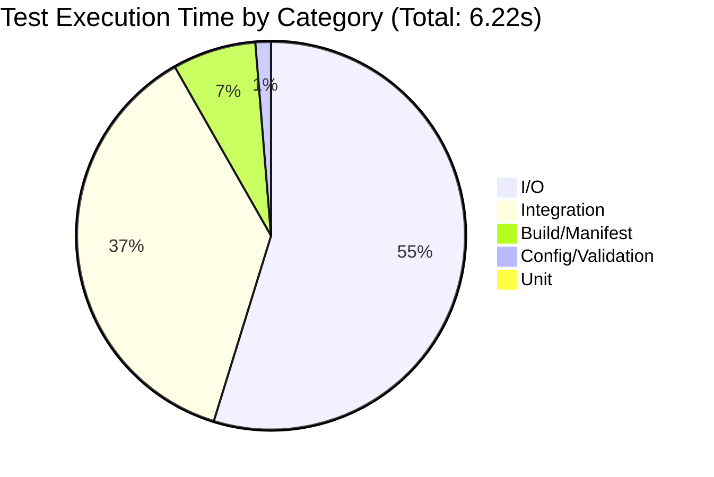

# Test Execution Time Analysis

This report shows the execution times of tests in the idpbuilder project.

## Overview

- **Total Tests**: 62
- **Total Execution Time**: 6.22s

## Slowest Individual Tests

| Rank | Test Name | Time (s) | Package |
|------|-----------|----------|---------|
| 1 | `TestCloneRemoteRepoToDir` | 2.27 | util |
| 2 | `TestGetGiteaToken` | 2.00 | localbuild |
| 3 | `TestGetWorktreeYamlFiles` | 0.61 | util |
| 4 | `TestCopyTreeToTree` | 0.51 | util |
| 5 | `TestBuildCustomizedManifests` | 0.43 | k8s |
| 6 | `TestGetK8sInstallResources` | 0.09 | localbuild |
| 7 | `TestGetConfigCustom` | 0.06 | kind |
| 8 | `TestGitRepositoryContentReconcile/files_modified` | 0.05 | gitrepository |
| 9 | `TestGitRepositoryContentReconcile` | 0.05 | gitrepository |
| 10 | `TestGitRepositoryReconcile/repo_updates` | 0.03 | gitrepository |

## Test Times by Category

Tests are categorized based on their functionality:

| Category | Total Time (s) | Test Count | Avg Time (s) |
|----------|----------------|------------|--------------|
| I/O | 3.39 | 5 | 0.678 |
| Integration | 2.29 | 19 | 0.121 |
| Build/Manifest | 0.43 | 1 | 0.430 |
| Config/Validation | 0.08 | 7 | 0.011 |
| Unit | 0.03 | 30 | 0.001 |

### Category Distribution (Mermaid Diagram)



### Category Distribution (Text)

```
I/O                     3.39s  █████████████████████
Integration             2.29s  ██████████████
Build/Manifest          0.43s  ██
Config/Validation       0.08s  
Unit                    0.03s  
```

## Test Times by Package

| Package | Total Time (s) | Test Count |
|---------|----------------|------------|
| util | 3.57 | 12 |
| localbuild | 2.11 | 4 |
| k8s | 0.45 | 4 |
| gitrepository | 0.15 | 10 |
| kind | 0.11 | 6 |
| build | 0.02 | 3 |
| get | 0.02 | 3 |
| platform | 0.02 | 5 |
| helpers | 0.02 | 2 |
| fs | 0.00 | 3 |

## Analysis: Why Do Tests Take Long?

### Key Findings

1. **Slowest Test Category**: `I/O`
   - Takes 3.39s total (54.5% of total time)
   - Contains 5 tests
   - Average time per test: 0.678s

2. **Slowest Package**: `util`
   - Takes 3.57s total (57.4% of total time)
   - Contains 12 tests

3. **Slowest Single Test**: `TestCloneRemoteRepoToDir`
   - Takes 2.27s (36.5% of total time)
   - This test clones a git repository, which requires network and disk I/O
   - Located in `pkg/util`

### Common Reasons for Slow Tests

1. **I/O Operations**: Tests that clone repositories, read/write files, or interact with the filesystem take longer due to disk I/O.

2. **Integration Tests**: Controller tests that set up Kubernetes environments and reconcile resources require more setup and teardown time.

3. **Network Operations**: Tests that interact with Gitea API or other network services may include retries and timeouts.

4. **Manifest Building**: Tests that generate, parse, or process Kubernetes manifests involve complex YAML/JSON operations.

### Recommendations for Improvement

1. **Parallelize where possible**: Some tests can run in parallel to reduce overall execution time.
2. **Mock external dependencies**: Replace actual I/O and network operations with mocks for unit tests.
3. **Use test fixtures**: Pre-generate test data to avoid repeated expensive operations.
4. **Split integration tests**: Consider separating integration tests from unit tests for faster feedback loops.
