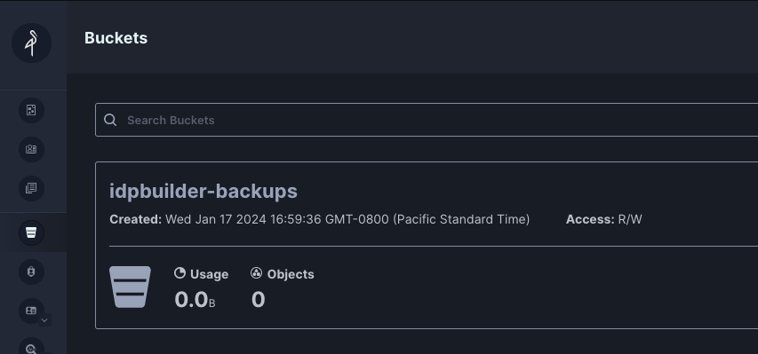
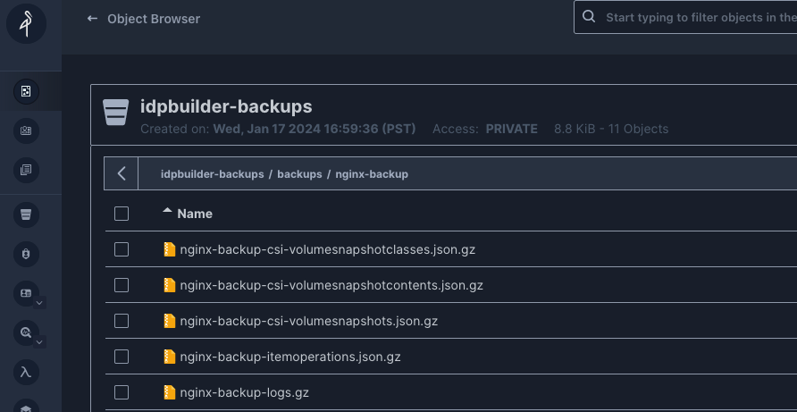

# Local Backup with Velero and Minio

This example creates a configuration that allows you to back up Kubernetes objects
to your laptop (or wherever you are running idpbuilder from).

In short, it:
1. Creates a [MinIO](https://min.io/) installation that mounts a local directory.
2. Creates a [Velero](https://velero.io/) installation that targets the in-cluster MinIO storage.

## Installation

First, we need to ensure the local cluster is configured to mount a local directory.
This is done through the kind configuration file that you can supply to `idpbuilder`.

Take a look at the [kind.yaml](./kind.yaml) file. The most relevant part is this bit:

```yaml
nodes:
  - role: control-plane
    extraMounts:
      - hostPath: /home/ubuntu/backup # replace with your own path
        containerPath: /backup
```

This instructs Kind to make your machine's directory at `/home/ubuntu/backup`
available at `/backup` for the Kubernetes node.

You **must** change this value for your own setup. This directory also must exist on your machine.
For example, you may want to change it to `/Users/my-name/backup`.

Once you've made the change, run this command from the root of this repository.

```bash
# example: mkdir /Users/my-name/backup
mkdir <path/to/directory> 

idpbuilder create --kind-config examples/local-backup/kind.yaml --package-dir examples/local-backup/
```

This command:
1. Creates a standard idpbuilder installation, a kind cluster and core packages (ArgoCD, Gitea, and Ingress-Nginx).
2. Creates two custom packages: [MinIO](./minio.yaml) and [Velero](./velero.yaml).

Once the command exits, you can check the status of installation by going to https://argocd.cnoe.localtest.me:8443/applications.

You can also check the status with the following command:

```bash
kubectl get application -n argocd
```

## Using it

Once MinIO and Velero ArgoCD applications are ready, you can start playing with it.

MinIO console is accessible at [https://minio.cnoe.localtest.me:8443/login](https://minio.cnoe.localtest.me:8443/login)

You can log in to the console by obtaining credentials:

```bash
kubectl -n minio get secret root-creds -o go-template='{{ range $key, $value := .data }}{{ printf "%s: %s\n" $key ($value | base64decode) }}{{ end }}'
# example output
# rootPassword: aKKZzLnyry6OYZts17vMTf32H5ghFL4WYgu6bHujm
# rootUser: ge8019yksArb7BICt3MLY9
```

Once you log in, you will notice a bucket is already created for you. Velero will use this bucket to back up kubernetes objects.



### Backup

Let's try creating a backup of an example application.

First, create an example nginx app straight from the Velero repository.

```bash
kubectl apply -f https://raw.githubusercontent.com/vmware-tanzu/velero/main/examples/nginx-app/base.yaml
```

Once they are created and running, create a backup.

```bash
kubectl apply -f examples/local-backup/demo/backup.yaml
```

This command is equivalent to this Velero command:  `velero backup create nginx-backup --selector app=nginx`

After you run the command, go back to the MinIO console. You will notice that file objects are created in your bucket.



You can also see these files on your local machine.

```shell
$ ls -lh /home/ubuntu/backup/idpbuilder-backups/backups/nginx-backup/
total 44K
drwxr-xr-x 2 ubuntu ubuntu 4.0K Jan 18 01:25 nginx-backup-csi-volumesnapshotclasses.json.gz
drwxr-xr-x 2 ubuntu ubuntu 4.0K Jan 18 01:25 nginx-backup-csi-volumesnapshotcontents.json.gz
drwxr-xr-x 2 ubuntu ubuntu 4.0K Jan 18 01:25 nginx-backup-csi-volumesnapshots.json.gz
drwxr-xr-x 2 ubuntu ubuntu 4.0K Jan 18 01:25 nginx-backup-itemoperations.json.gz
drwxr-xr-x 2 ubuntu ubuntu 4.0K Jan 18 01:25 nginx-backup-logs.gz
drwxr-xr-x 2 ubuntu ubuntu 4.0K Jan 18 01:25 nginx-backup-podvolumebackups.json.gz
drwxr-xr-x 2 ubuntu ubuntu 4.0K Jan 18 01:25 nginx-backup-resource-list.json.gz
drwxr-xr-x 2 ubuntu ubuntu 4.0K Jan 18 01:25 nginx-backup-results.gz
drwxr-xr-x 2 ubuntu ubuntu 4.0K Jan 18 01:25 nginx-backup-volumesnapshots.json.gz
drwxr-xr-x 2 ubuntu ubuntu 4.0K Jan 18 01:25 nginx-backup.tar.gz
drwxr-xr-x 2 ubuntu ubuntu 4.0K Jan 18 01:25 velero-backup.json
```

### Restore

Let's simulate a cluster loss by deleting the kind cluster forcibly.

```bash
kind delete clusters localdev && docker system prune -f
```

Once it is destroyed, create it again.

```bash
idpbuilder create --kind-config examples/local-backup/kind.yaml --package-dir examples/local-backup/
```

Make sure everything looks good:

```bash
$ kubectl get application -n argocd
NAME     SYNC STATUS   HEALTH STATUS
argocd   Synced        Healthy
gitea    Synced        Healthy
minio    Synced        Healthy
nginx    Synced        Healthy
velero   Synced        Healthy
```

Let's make sure Velero can validate the MinIO bucket:

```bash
$ kubectl get  backupstoragelocations.velero.io  -n velero
NAME      PHASE       LAST VALIDATED   AGE   DEFAULT
default   Available   4s               52m   true
```

Looks good. Let's make sure the backup from the destroyed cluster is available.

```bash
$ kubectl get backup -n velero
NAME           AGE
nginx-backup   1m
```

Target this backup to restore objects.

```bash
kubectl apply -f examples/local-backup/demo/restore.yaml
```

This command is equivalent to `velero restore create --from-backup nginx-backup`.

Verify everything was restored:
```bash
$ kubectl get backup -n velero  -o custom-columns="NAME":.metadata.name,"PHASE":.status.phase
NAME           PHASE
nginx-backup   Completed

$ kubectl get pods -n nginx-example
```

