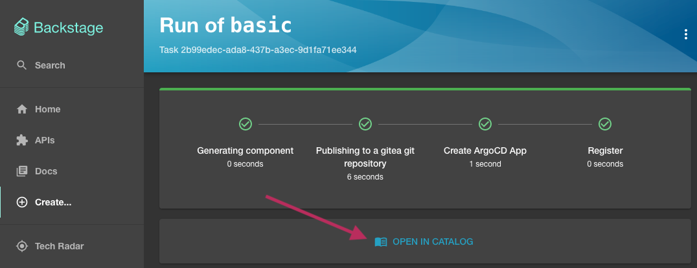
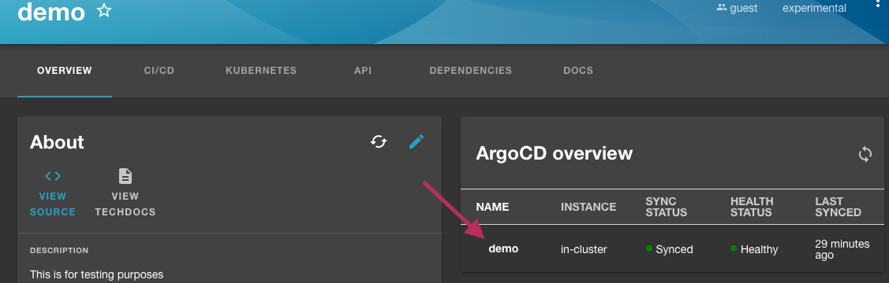
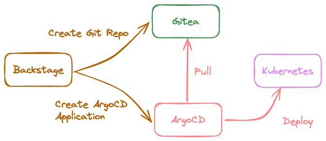
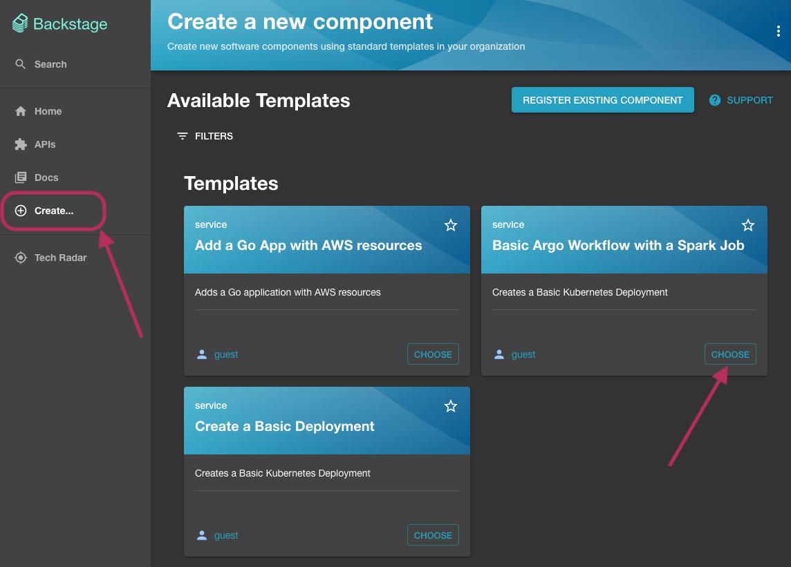
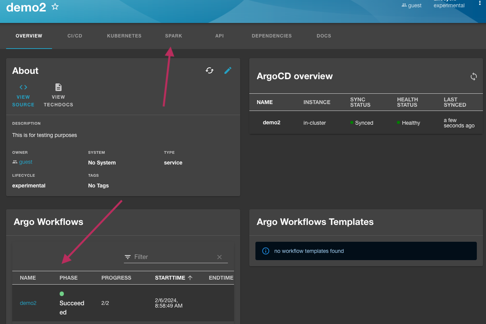

# Reference implementation 

This example creates a local version of the CNOE reference implementation.

## Installation

Run the following command from the root of this repository.

```bash
idpbuilder create --package-dir examples/ref-implementation
```

This will take ~6 minutes for everything to come up. To track the progress, you can go to the [ArgoCD UI](https://argocd.cnoe.localtest.me:8443/applications).

### What was installed?

1. **Argo Workflows** to enable workflow orchestrations.
2. **Backstage** as the UI for software catalog and templating. Source is available [here](https://github.com/cnoe-io/backstage-app).
3. **Crossplane**, AWS providers, and basic compositions for deploying cloud related resources (needs your credentials for this to work)
4. **External Secrets** to generate secrets and coordinate secrets between applications.
5. **Keycloak** as the identity provider for applications.
6. **Spark Operator** to demonstrate an example Spark workload through Backstage.

#### Accessing UIs
- Argo CD: https://argocd.cnoe.localtest.me:8443
- Argo Workflows: https://argo.cnoe.localtest.me:8443
- Backstage: https://backstage.cnoe.localtest.me:8443
- Gitea: https://gitea.cnoe.localtest.me:8443
- Keycloak: https://keycloak.cnoe.localtest.me:8443/admin/master/console/

# Using it

For this example, we will walk through a few demonstrations. Once applications are ready, go to the [backstage URL](https://backstage.cnoe.localtest.me:8443).

Click on the Sign-In button, you will be asked to log into the Keycloak instance. There are two users set up in this 
configuration, and their password can be retrieved with the following command:

```bash
kubectl -n keycloak get secret keycloak-config \
  -o go-template='{{ range $key, $value := .data }}{{ printf "%s: %s\n" $key ($value | base64decode) }}{{ end }}'
```

Use the username **`user1`** and the password value given by `USER_PASSWORD` field to login to the backstage instance. 

## Basic Deployment

Let's start by deploying a simple application to the cluster through Backstage.

Click on the `Create...` button on the left, then select the `Create a Basic Deployment` template.


In the next screen, type `demo` for the name field, then click create. 
Once steps run, click the Open In Catalog button to go to the entity page. 



In the demo entity page, you will notice a ArgoCD overview card associated with this entity. 
You can click on the ArgoCD Application name to see more details.



### What just happened?

1. Backstage created [a git repository](https://gitea.cnoe.localtest.me:8443/giteaAdmin/demo), then pushed templated contents to it.
2. Backstage created [an ArgoCD Application](https://argocd.cnoe.localtest.me:8443/applications/argocd/demo?) and pointed it to the git repository.
3. Backstage registered the application as [a component](https://gitea.cnoe.localtest.me:8443/giteaAdmin/demo/src/branch/main/catalog-info.yaml) in Backstage.
4. ArgoCD deployed the manifests stored in the repo to the cluster.
5. Backstage retrieved application health from ArgoCD API, then displayed it.




## Argo Workflows and Spark Operator

In this example, we will deploy a simple Apache Spark job through Argo Workflows.

Click on the `Create...` button on the left, then select the `Basic Argo Workflow witha Spark Job` template.



Type `demo2` for the name field, then click create. You will notice that the Backstage templating steps are very similar to the basic example above.
Click on the Open In Catalog button to go to the entity page.



Deployment processes are the same as the first example. Instead of deploying a pod, we deployed a workflow to create a Spark job.

In the entity page, there is a card for Argo Workflows, and it should say running or succeeded. 
You can click the name in the card to go to the Argo Workflows UI to view more details about this workflow run. 
When prompted to log in, click the login button under single sign on. Argo Workflows is configured to use SSO with Keycloak allowing you to login with the same credentials as Backstage login.

Note that Argo Workflows are not usually not deployed this way. This is just an example to show you how you can integrate workflows, backstage, and spark.

Back in the entity page, you can view more details about Spark jobs by navigating to the Spark tab.

## Application with cloud resources.

Similarly to the above, we can deploy an application with cloud resources using Backstage templates.
In this example, we will create an application with a S3 Bucket.

Choose a template named `App with S3 bucket`, type `demo3` as the name, then choose a region to create this bucket in.

Once you click the create button, you will have a very similar setup as the basic example. 
The only difference is we now have a resource for a S3 Bucket which is managed by Crossplane.

Note that Bucket is **not** created because Crossplane doesn't have necessary credentials to do so.
If you'd like it to actually create a bucket, update [the credentials secret file](crossplane-providers/provider-secret.yaml), then run `idpbuilder create --package-dir examples/ref-implementation`.

In this example, we used Crossplane to provision resources, but you can use other cloud resource management tools such as Terraform instead. 
Regardless of your tool choice, concepts are the same. We use Backstage as the templating mechanism and UI for users, then use Kubernetes API with GitOps to deploy resources. 

## Notes

- In these examples, we have used the pattern of creating a new repository for every app, then having ArgoCD deploy it.
This is done for convenience and demonstration purposes only. There are alternative actions that you can use. 
For example, you can create a PR to an existing repository, create a repository but not deploy them yet, etc.

- If Backstage's pipelining and templating mechanisms is too simple, you can use more advanced workflow engines like Tekton or Argo Workflows. 
  You can invoke them in Backstage templates, then track progress similar to how it was described above.  
