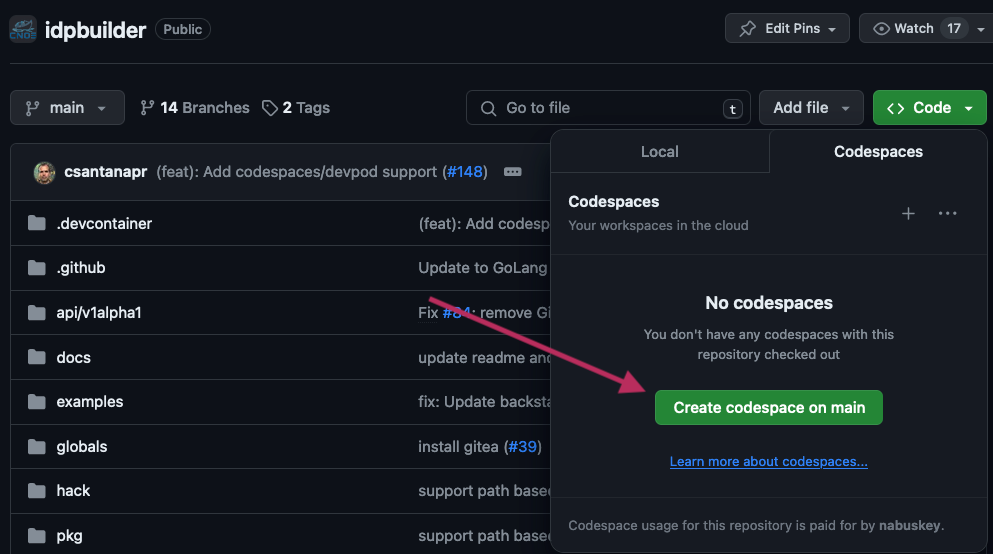
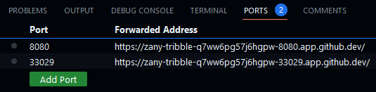

## Running idpbuilder in Codespaces in Browser

**_NOTE:_**: __Steps described below applies to running this implementation in Codespaces in **web browsers** (e.g. Firefox and Chrome).
If you are using Codespaces with GitHub CLI, steps described here do not apply to you.__ 


Let's create an instance of Codespaces.



It may take a few minutes for it to be ready. Once it's ready, you can either get the latest release of idpbuilder or build from the main branch.
Build the idpbuilder binary. 


- Get the latest release:
  ```bash
  version=$(curl -Ls -o /dev/null -w %{url_effective} https://github.com/cnoe-io/idpbuilder/releases/latest)
  version=${version##*/}
  wget https://github.com/cnoe-io/idpbuilder/releases/download/${version}/idpbuilder-linux-amd64.tar.gz
  tar xzf idpbuilder-linux-amd64.tar.gz
  sudo mv ./idpbuilder /usr/local/bin/
  ```
- Alternatively, build from the main branch
  ```bash
  make build
  sudo mv ./idpbuilder /usr/local/bin/
  ```

Codespaces assigns random hostname to your specific instance. You need to make sure they are reflected correctly.
Instance host name is available as an environment variable (`CODESPACE_NAME`). Let's use it to setup our host names. 
Run the following commands to update host name and ports. Port is set to 443 because this is the port used by the browser to access your instance.


```bash
cd examples/ref-implementation 

./replace.sh ${CODESPACE_NAME}-8080.${GITHUB_CODESPACES_PORT_FORWARDING_DOMAIN} 443

cd - 
```

Now you are ready to run idpbuilder with reference implementation.

```bash
idpbuilder create --protocol http  \
  --host ${CODESPACE_NAME}-8080.${GITHUB_CODESPACES_PORT_FORWARDING_DOMAIN} \
  --port 8080 --use-path-routing --package-dir examples/ref-implementation
```
Once idpbuilder finishes bootstrapping, you should have port 8080 forward in the port tab within Codespaces.



You may get a 404 page after clicking the port 8080 forwarded address. This is completely normal because Backstage may not be ready yet. 
Give it a few more minutes and it should redirect you to a Backstage page.

### Accessing UIs

If you'd like to track progress of deployment, go to `/argocd` path and login with your ArgoCD credentials. 
For example run this command to get the URL for Argo CD:
```bash
echo https://${CODESPACE_NAME}-8080.${GITHUB_CODESPACES_PORT_FORWARDING_DOMAIN}/argocd
```

From here on, you can follow the instructions in the [README](./README.md) file. The only difference is that the URL to access UIs is given by:

```echo
echo https://${CODESPACE_NAME}-8080.${GITHUB_CODESPACES_PORT_FORWARDING_DOMAIN}
```

For example, if you need to access Argo Workflows UI, instead of going to `https://cnoe.localtest.me:8443/argo`, 
you go to `https://${CODESPACE_NAME}-8080.${GITHUB_CODESPACES_PORT_FORWARDING_DOMAIN}/argo`
